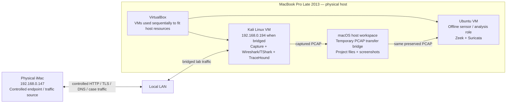
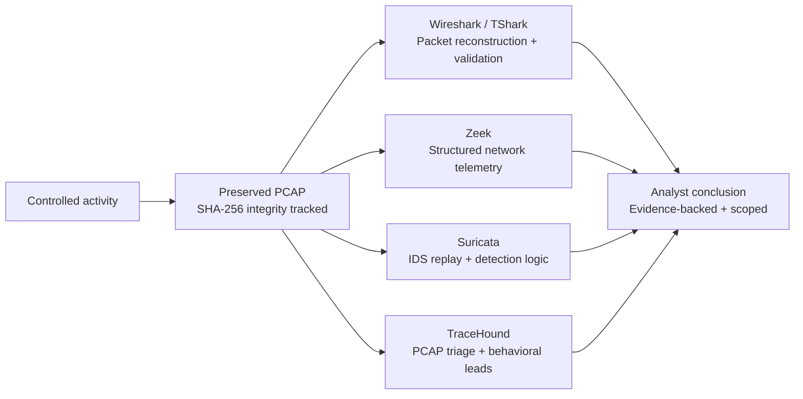
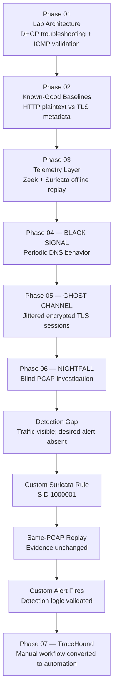
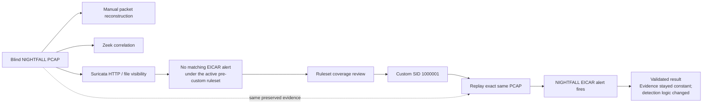
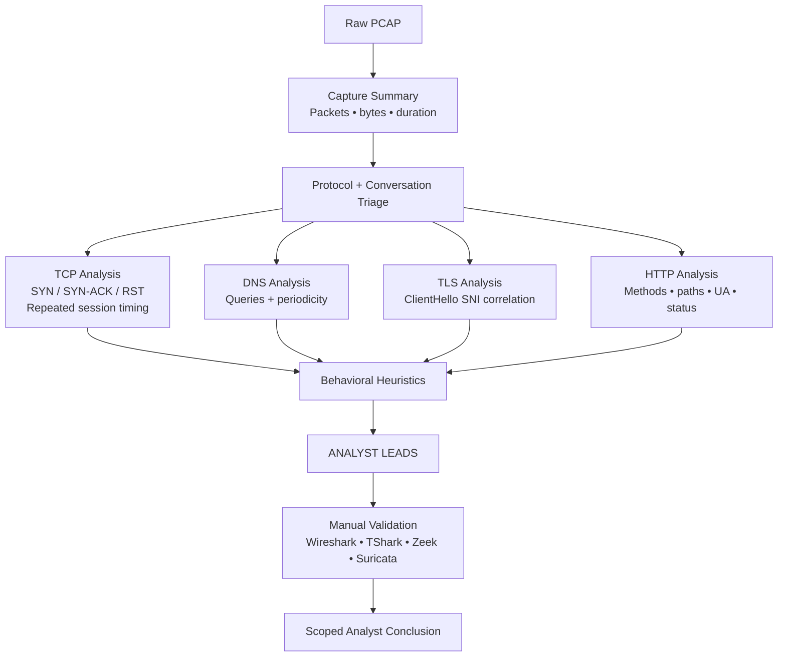
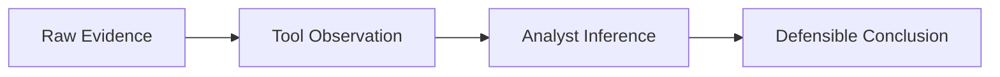

# Architecture & Investigation Flow

> **Physical endpoint → packet evidence → telemetry → detection → analyst validation → automation**

This project is one connected blue-team workflow rather than a set of isolated labs. The diagrams below separate the **physical/virtual topology** from the **evidence-analysis flow** so the environment is not mistaken for several independent physical hosts.

---

## 1. Physical & Virtual Lab Topology



### Why this topology mattered

The physical iMac generated controlled traffic without consuming MacBook VM resources. The MacBook was the virtualization host, while Kali and Ubuntu were used in different analysis roles rather than pretending to be separate physical systems.

Kali handled capture, manual packet analysis, and TraceHound development. Ubuntu later processed preserved captures through Zeek and Suricata. The MacBook host acted only as a temporary evidence-transfer bridge between those VM workflows.

---

## 2. Evidence & Analysis Architecture



The important design decision was reuse of the **same preserved evidence**. Traffic did not need to be regenerated for every tool.

```text
Generate controlled activity once
        ↓
Preserve the PCAP
        ↓
Hash the evidence
        ↓
Analyze the same artifact through multiple tools
        ↓
Compare observations
        ↓
State only what the evidence supports
```

---

## 3. Investigation Progression



The progression was intentional. TraceHound came last because the repetitive workflow was understood manually before it was automated.

---

## 4. NIGHTFALL Detection-Engineering Loop



This is the central detection-engineering result of the project. Suricata had already reconstructed the relevant HTTP/file transaction, so the missing alert was treated as a **coverage problem relative to the lab objective**, not a visibility failure.

---

## 5. TraceHound Analyst Pipeline



TraceHound deliberately stops at **analyst leads**. It does not turn heuristics into unsupported verdicts such as `C2 confirmed`, `malware detected`, or `host compromised`.

---

## 6. Evidence Model



| Evidence | Tool observation | Defensible conclusion |
|---|---|---|
| Repeated DNS timestamps | Dominant ~10 s interval with retry-like tail | Periodic DNS behavior worth review |
| Six TLS ClientHellos to one SNI | Repeated TLS identity + jittered timing | Encrypted recurring communication worth review |
| Traversal-shaped HTTP URI + HTTP 404 | Path anomaly observed | Traversal attempt observed; success not proven |
| EICAR content transferred + no matching alert | Traffic visible; desired detection absent | Detection coverage gap relative to the lab objective |
| Same PCAP + custom SID fires | Detection result changes after rule change | Custom detection closed the tested coverage gap |

---

## Final Architecture Principle

> **Packets provide the evidence. Telemetry organizes it. Detection logic evaluates patterns. The analyst decides what those patterns mean and what the evidence actually proves.**
