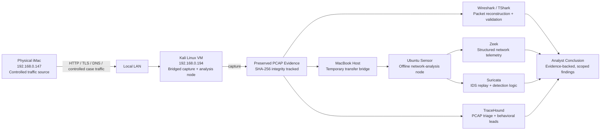
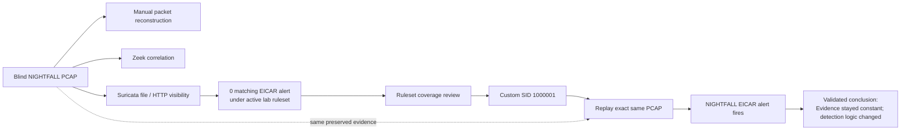
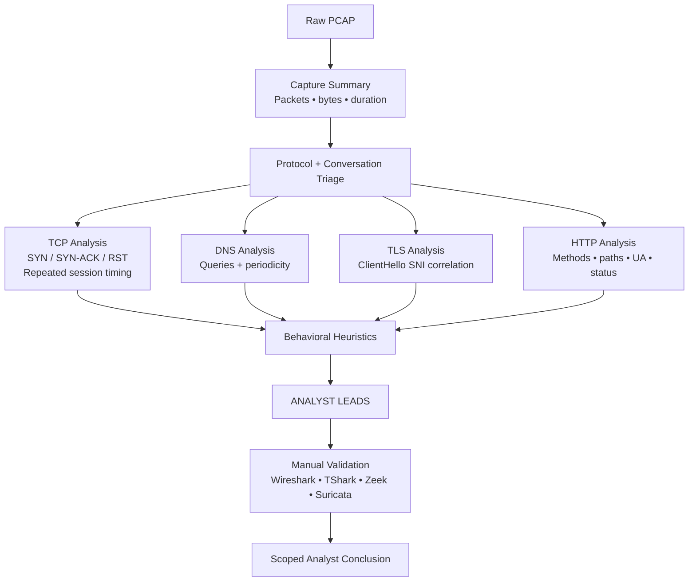
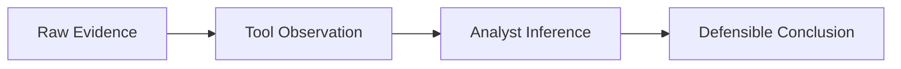

# Architecture & Investigation Flow

> **Physical endpoint → packet evidence → telemetry → detection → analyst validation → automation**

This project was designed as one connected blue-team workflow rather than a set of isolated labs. The diagrams below show how traffic moved through the environment, how the same preserved evidence was reused across tools, and how the investigation process evolved into TraceHound.

---

## 1. Lab & Evidence Architecture



### Why this architecture mattered

The same packet evidence could be inspected manually, converted into Zeek telemetry, replayed through Suricata, and later processed by TraceHound without regenerating the traffic for each tool.

That created a simple trust model:

```text
Generate activity once
        ↓
Preserve the PCAP
        ↓
Hash the evidence
        ↓
Analyze the same artifact through multiple tools
        ↓
Compare findings
        ↓
State only what the evidence supports
```

---

## 2. Investigation Progression


The progression was intentional. TraceHound came last because the repetitive workflow needed to be understood manually before it was automated.

---

## 3. NIGHTFALL Detection-Engineering Loop



This is the central detection-engineering result of the project. Suricata had already reconstructed the relevant HTTP/file transaction, so the missing alert was treated as a coverage problem relative to the lab objective rather than a visibility failure.

---

## 4. TraceHound Analyst Pipeline



TraceHound deliberately stops at **analyst leads**. It does not turn heuristics into unsupported verdicts such as `C2 confirmed`, `malware detected`, or `host compromised`.

---

## 5. Evidence Model

The entire project follows one rule:



Examples:

| Evidence | Tool observation | Defensible conclusion |
|---|---|---|
| Repeated DNS timestamps | Dominant ~10s interval with retry-like tail | Periodic DNS behavior worth review |
| Six TLS ClientHellos to one SNI | Repeated TLS identity + jittered timing | Encrypted recurring communication worth review |
| Traversal-shaped HTTP URI + HTTP 404 | Path anomaly observed | Traversal attempt observed; success not proven |
| EICAR content transferred + no matching stock alert | Traffic visible, desired detection absent | Detection coverage gap relative to lab objective |
| Same PCAP + custom SID fires | Detection result changes after rule change | Custom detection closed the tested coverage gap |

---

## Final Architecture Principle

> **Packets provide the evidence. Telemetry organizes it. Detection logic interprets patterns. The analyst decides what the evidence actually proves.**
