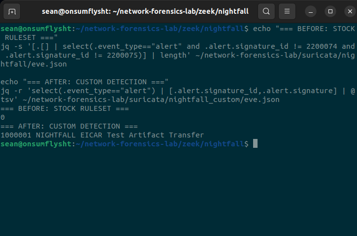
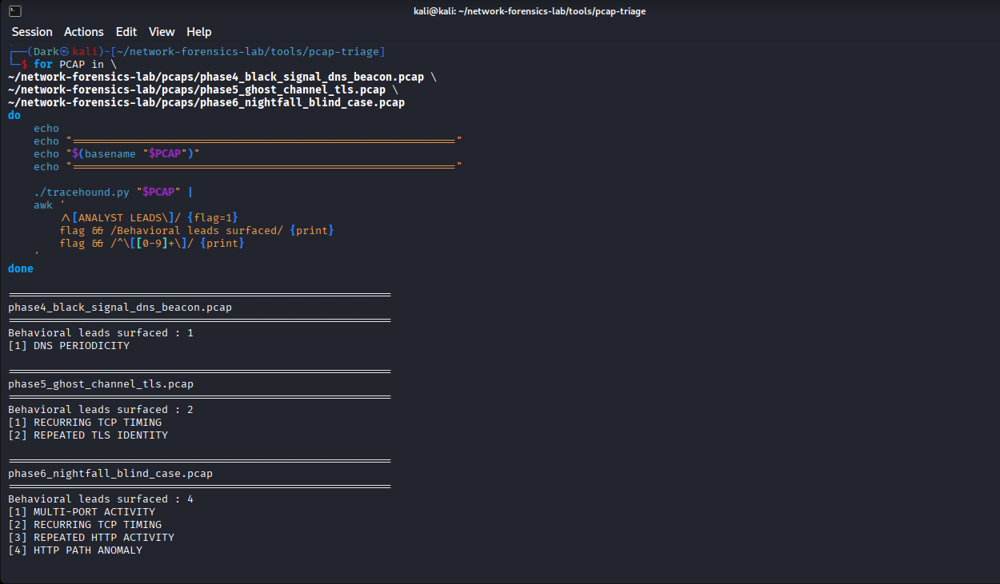

# Network Detection & Packet Forensics Home Lab

> **Packets → Telemetry → Detection → Reconstruction → Validation**

A blue-team network forensics project focused on reconstructing suspicious traffic from raw packet captures, correlating findings with Zeek and Suricata, identifying detection gaps, validating custom IDS logic, and automating first-pass PCAP triage with a custom Python tool called **TraceHound**.

This project was built as a progression rather than a collection of disconnected exercises. Each phase adds another layer of analysis while preserving the same central question:

> **What does the network evidence actually prove?**

---

## 60-Second Case File

If you only have a minute, these are the two results that best represent the project.

### 1. NIGHTFALL — Detection Gap → Custom Rule → Same-PCAP Validation

A blind PCAP investigation reconstructed reconnaissance, successful HTTP artifact transfers, a failed traversal attempt, and repeated check-ins. Suricata could see and reconstruct the EICAR test-file transfer, but the active ruleset did not produce a matching alert. I wrote custom SID `1000001` and replayed the **exact same preserved PCAP**.

```text
BEFORE  → 0 matching EICAR detection
AFTER   → SID 1000001 triggered
```

The evidence did not change. **The detection logic changed.**



### 2. TraceHound — One Generic Tool, Three Different Investigations

After completing the investigations manually, I built **TraceHound** to automate repetitive first-pass PCAP triage while leaving final interpretation to the analyst.

The same v1.0 code was replayed against all three prior cases without hardcoding their expected answers:

```text
BLACK SIGNAL  → DNS PERIODICITY

GHOST CHANNEL → RECURRING TCP TIMING
                REPEATED TLS IDENTITY

NIGHTFALL     → MULTI-PORT ACTIVITY
                RECURRING TCP TIMING
                REPEATED HTTP ACTIVITY
                HTTP PATH ANOMALY
```



**Fast links:** [NIGHTFALL](docs/phase-06-investigation-03-nightfall.md) · [TraceHound](docs/phase-07-pcap-triage.md) · [TraceHound source](tools/pcap-triage/tracehound.py) · [Custom Suricata rule](rules/nightfall.rules)

---

## Project Goals

The lab was designed to practice the full investigative path from raw traffic to analyst conclusion:

- build a small physical + virtual network lab
- generate controlled network activity
- preserve packet captures as evidence
- establish normal HTTP and TLS baselines
- process the same evidence through Zeek and Suricata
- investigate periodic DNS and encrypted recurring communication
- complete a blind PCAP investigation without knowing the answer first
- distinguish suspicious attempts from successful actions
- identify an IDS coverage gap
- create and validate a custom Suricata rule
- convert repeated analyst workflows into a reusable Python triage utility

The project intentionally avoids treating tool output as truth by default. Wireshark, TShark, Zeek, Suricata, and TraceHound are treated as evidence sources that still require analyst interpretation.

---

## Architecture

| Role | System | Purpose |
|---|---|---|
| Physical endpoint | iMac | Generates controlled client traffic |
| Packet analysis node | Kali Linux VM | Capture, Wireshark, TShark, Python / TraceHound |
| Network telemetry / IDS sensor | Ubuntu VM | Zeek and Suricata offline analysis |
| Transfer bridge | MacBook host | Temporary evidence transfer between VMs |

Core lab addresses used during the investigations:

```text
Physical iMac        192.168.0.147
Kali analysis node   192.168.0.194
```

The architecture was deliberately kept lightweight so the systems could be used sequentially rather than requiring every VM to run at once.

---

# Project Progression

## Phase 01 — Lab Architecture & Network Preparation

The project began by validating physical-to-virtual communication between the iMac endpoint and the bridged Kali VM.

A DHCP / address-conflict-detection problem initially prevented Kali from maintaining a stable bridged IPv4 address. Packet capture showed DHCP request/reply activity followed by a DHCP Decline. The issue was resolved by adjusting NetworkManager's IPv4 duplicate-address-detection timeout and re-establishing the connection.

The final validation capture contained a clean bidirectional ICMP exchange between the endpoint and Kali.

**Key skills:**

```text
DHCP troubleshooting
ARP / address-conflict analysis
bridged networking
packet capture
ICMP validation
evidence hashing
```

[Read Phase 01](docs/phase-01-lab-architecture.md)

---

## Phase 02 — Baseline Packet Analysis

Normal HTTP and TLS traffic was generated before introducing suspicious behavior.

The HTTP baseline demonstrated how much application content remains visible in plaintext, including:

```text
GET /
Host
User-Agent
HTTP 200 response
response body
```

The TLS baseline demonstrated the opposite: connection setup and metadata remained visible, but application data became encrypted after negotiation.

Observed TLS metadata included:

```text
SNI: kali.local
TLS version
cipher suite
certificate subject
connection endpoints
```

This baseline later became important when comparing normal network behavior with the encrypted recurring sessions in GHOST CHANNEL.

**Key skills:**

```text
HTTP analysis
TLS handshake analysis
SNI extraction
certificate inspection
packet filtering
baseline creation
```

[Read Phase 02](docs/phase-02-baseline-analysis.md)

---

## Phase 03 — Zeek & Suricata Telemetry

The preserved baseline PCAPs were transferred to the Ubuntu sensor and processed offline through:

```text
Zeek 7.0.11
Suricata 8.0.6
```

Zeek transformed the raw packet evidence into structured connection, HTTP, TLS, and certificate telemetry.

Suricata provided the IDS perspective and introduced an important distinction that continued throughout the project:

> **Traffic can be observable without producing a meaningful alert.**

Known checksum-offloading artifacts were separated from security-relevant findings rather than treated as detections.

**Key skills:**

```text
Zeek conn.log
Zeek http.log
Zeek ssl/x509 telemetry
Suricata offline replay
checksum artifact handling
cross-tool correlation
```

[Read Phase 03](docs/phase-03-zeek-suricata.md)

---

# Investigation 01 — BLACK SIGNAL

## Phase 04 — Periodic DNS Behavior

BLACK SIGNAL introduced controlled recurring DNS activity involving:

```text
pulse.blacksignal.test
```

The investigation measured query timing directly from packet timestamps.

The initial successful sequence showed intervals around ten seconds, while the tail of the capture contained shorter retry-like intervals after the DNS service was interrupted.

The strongest conclusion was therefore not simply that DNS repeated, but that:

> **The initial activity contained a highly consistent recurring DNS cadence, followed by retry behavior after service interruption.**

Zeek independently reconstructed the DNS behavior, while Suricata produced no meaningful detection for the activity.

The case was intentionally described as **periodic / beacon-like** rather than confirmed command-and-control.

**Key skills:**

```text
DNS analysis
inter-event timing
periodicity measurement
retry behavior interpretation
Zeek DNS correlation
false-positive-aware conclusions
```

[Read BLACK SIGNAL](docs/phase-04-investigation-01-black-signal.md)

---

# Investigation 02 — GHOST CHANNEL

## Phase 05 — Encrypted Recurring Communication

GHOST CHANNEL introduced six repeated TLS sessions to:

```text
192.168.0.194:9443
```

using the SNI:

```text
sync.ghostchannel.test
```

The session spacing intentionally included jitter:

```text
8.195s
13.116s
9.116s
15.163s
7.172s
```

This created a more realistic timing problem than a perfectly fixed interval.

The packet evidence supported:

- repeated TCP sessions
- the same destination service
- the same TLS SNI
- bounded timing variation
- encrypted application content

It did **not** support claiming confirmed C2 because the encrypted payload itself could not be inspected.

**Key skills:**

```text
TLS metadata analysis
SNI correlation
encrypted traffic reasoning
jitter analysis
repeated-session timing
Zeek TLS correlation
```

[Read GHOST CHANNEL](docs/phase-05-investigation-02-ghost-channel.md)

---

# Investigation 03 — NIGHTFALL

## Phase 06 — Blind PCAP Investigation & Detection Engineering

NIGHTFALL was the blind investigation phase.

The case-generation details, server logs, Zeek output, and Suricata output were deliberately withheld until the initial packet-level investigation was complete.

The objective was to approach the PCAP as an unfamiliar analyst case and reconstruct the activity from network evidence first.

The final sequence contained:

```text
TCP reconnaissance
        ↓
TCP/8080 identified as accessible
        ↓
GET /update.dat                → 200
        ↓
GET /eicar.com                 → 200
        ↓
GET /../../../../etc/passwd    → 404
        ↓
repeated /checkin requests     → 404
```

Important evidence distinctions were preserved:

- `/update.dat` was successfully transferred, but packet evidence alone did not prove it was malicious.
- the EICAR artifact was successfully transferred, but EICAR is a harmless antivirus test artifact rather than malware.
- the traversal-shaped request was suspicious, but it failed with HTTP 404 and no `/etc/passwd` contents were returned.
- the repeated check-ins were callback-like, but successful command-and-control was not established.

Zeek later independently reproduced the manually established connection and HTTP timeline.

### Detection Gap

The stock Suricata ruleset did not produce a meaningful EICAR-transfer alert in the lab replay.

That was treated as a **detection-coverage gap relative to the lab objective**, not as proof that Suricata generally cannot detect EICAR.

A custom rule was created:

```suricata
alert http any any -> any any (msg:"NIGHTFALL EICAR Test Artifact Transfer"; flow:established,to_client; file.data; content:"EICAR-STANDARD-ANTIVIRUS-TEST-FILE"; sid:1000001; rev:1;)
```

The exact same PCAP was replayed again.

Before the custom rule:

```text
0 matching EICAR detection
```

After the custom rule:

```text
SID 1000001 triggered
```

The evidence had not changed.

> **The detection logic changed.**

That before/after replay became the strongest detection-engineering result in the project.

**Key skills:**

```text
blind PCAP investigation
reconnaissance reconstruction
HTTP timeline analysis
success vs failed-attempt reasoning
Zeek correlation
Suricata gap analysis
custom IDS rule development
replay validation
```

[Read NIGHTFALL](docs/phase-06-investigation-03-nightfall.md)

[View custom Suricata rule](rules/nightfall.rules)

---

# Phase 07 — TraceHound

## PCAP Triage & Behavioral Analysis

After completing the three investigations manually, Phase 7 converted the repeated first-pass workflow into a custom Python tool.

**TraceHound** uses Scapy to parse packet captures and surface evidence-backed analyst leads.

It performs:

```text
capture summary
protocol distribution
IP conversation ranking
TCP SYN / SYN-ACK / RST triage
multi-port activity review
repeated TCP timing analysis
jitter classification
DNS query and periodicity analysis
TLS ClientHello SNI extraction
plaintext HTTP triage
repeated resource identification
traversal-pattern review
consolidated analyst leads
```

The tool was intentionally built only after those workflows had already been performed manually.

## Analyst-First Output

TraceHound does not automatically output conclusions such as:

```text
C2 detected
malware confirmed
host compromised
attack successful
```

Instead it surfaces observations such as:

```text
DNS PERIODICITY
RECURRING TCP TIMING
REPEATED TLS IDENTITY
MULTI-PORT ACTIVITY
REPEATED HTTP ACTIVITY
HTTP PATH ANOMALY
```

and marks them for analyst review.

## Final Validation

The exact same generic v1.0 code was replayed against the earlier cases.

It surfaced:

```text
BLACK SIGNAL
  → DNS PERIODICITY

GHOST CHANNEL
  → RECURRING TCP TIMING
  → REPEATED TLS IDENTITY

NIGHTFALL
  → MULTI-PORT ACTIVITY
  → RECURRING TCP TIMING
  → REPEATED HTTP ACTIVITY
  → HTTP PATH ANOMALY
```

The tool did not contain those case indicators as hardcoded expected answers. They were extracted from the packet evidence at runtime.

[Read Phase 07](docs/phase-07-pcap-triage.md)

[Open TraceHound](tools/pcap-triage/tracehound.py)

[TraceHound usage & design](tools/pcap-triage/README.md)

---

# Evidence Integrity

The main investigation PCAPs were preserved with SHA-256 hashes.

Examples include:

```text
eeb3054d76ef3b427356b0168519243bea39b0d13c492683d37e286c3489c2e6  phase1_imac_kali_icmp.pcap
34d1676b7bb3280182266f8dcab9e4be5addb7110e98916cee2a61d8f04e98d3  phase2_baseline_http.pcap
603a0e49487601906a2274598f702b20da50a1185b13c1e88751725963f39f92  phase2_tls_baseline.pcap
156871f9d37b062f72b0e7c26dcb445c7676ea678361bc83fe764bd0326bdc3e  phase4_black_signal_dns_beacon.pcap
6f57f39528fd23fac67f51a7f40470f43faf354c6459250bef3aa96efa7b0c2d  phase5_ghost_channel_tls.pcap
493139937f20b19706671896e46bf5e86a15b61a41d3527a2daf2835731955cb  phase6_nightfall_blind_case.pcap
```

[View the SHA-256 ledger](hashes/SHA256SUMS.txt)

Hashing was used to verify that evidence remained unchanged while moving between analysis systems and replay stages.

---

# Tools Used

| Category | Tools |
|---|---|
| Packet capture & inspection | Wireshark, TShark, tcpdump |
| Network telemetry | Zeek |
| IDS / detection | Suricata |
| Scripting / automation | Python, Scapy |
| Integrity | SHA-256 / sha256sum |
| Lab platforms | Kali Linux, Ubuntu, physical macOS endpoint, VirtualBox |

---

# Core Analyst Lessons

## 1. Detection Is Not the Same as Evidence

An IDS alert is one interpretation layer. The packet capture remains the underlying evidence.

## 2. Suspicious Syntax Does Not Prove Success

A traversal request can be proven from the URI. Successful disclosure requires proof from the response.

## 3. Repetition Does Not Automatically Mean C2

Recurring DNS, repeated TLS sessions, and automated HTTP requests can be suspicious, but legitimate automation can produce similar patterns.

## 4. Encrypted Traffic Still Contains Useful Metadata

Even without payload decryption, timing, endpoints, ports, TLS handshake metadata, and SNI can support investigation.

## 5. Detection Gaps Should Be Validated With the Same Evidence

NIGHTFALL's custom rule was tested against the exact same preserved PCAP before and after the detection logic changed.

## 6. Automation Should Follow Understanding

TraceHound was built after the manual investigations, not before them.

The goal was to automate tasks that were already understood rather than hiding the reasoning behind a tool.

---

# Repository Structure

```text
Network-Detection-and-Packet-Forensics-home-lab/
├── README.md
├── docs/
│   ├── phase-01-lab-architecture.md
│   ├── phase-02-baseline-analysis.md
│   ├── phase-03-zeek-suricata.md
│   ├── phase-04-investigation-01-black-signal.md
│   ├── phase-05-investigation-02-ghost-channel.md
│   ├── phase-06-investigation-03-nightfall.md
│   └── phase-07-pcap-triage.md
├── evidence/
│   └── images/
├── hashes/
│   └── SHA256SUMS.txt
├── rules/
│   └── nightfall.rules
└── tools/
    └── pcap-triage/
        ├── README.md
        └── tracehound.py
```

---

# Project Outcome

The finished project demonstrates a complete network-focused blue-team workflow:

```text
Build the lab
    ↓
Capture and understand normal traffic
    ↓
Investigate controlled suspicious behavior
    ↓
Reconstruct activity from packets
    ↓
Correlate with structured telemetry
    ↓
Evaluate IDS coverage
    ↓
Engineer and replay a custom detection
    ↓
Automate repetitive triage
```

The final result is not just a set of screenshots or tool outputs. It is a documented investigation chain showing how conclusions were formed, what could and could not be proven, where detection logic failed, how that gap was tested, and how repetitive analysis was converted into a reusable analyst utility.

> **Evidence first. Detection second. Analyst conclusion last.**
