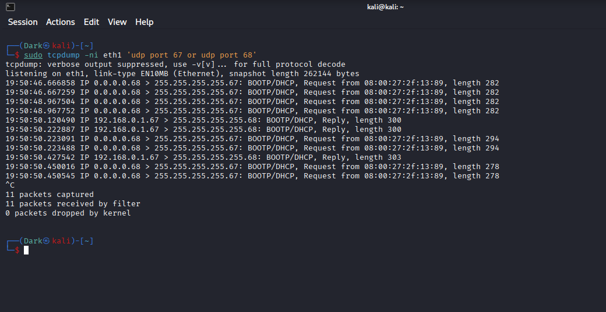
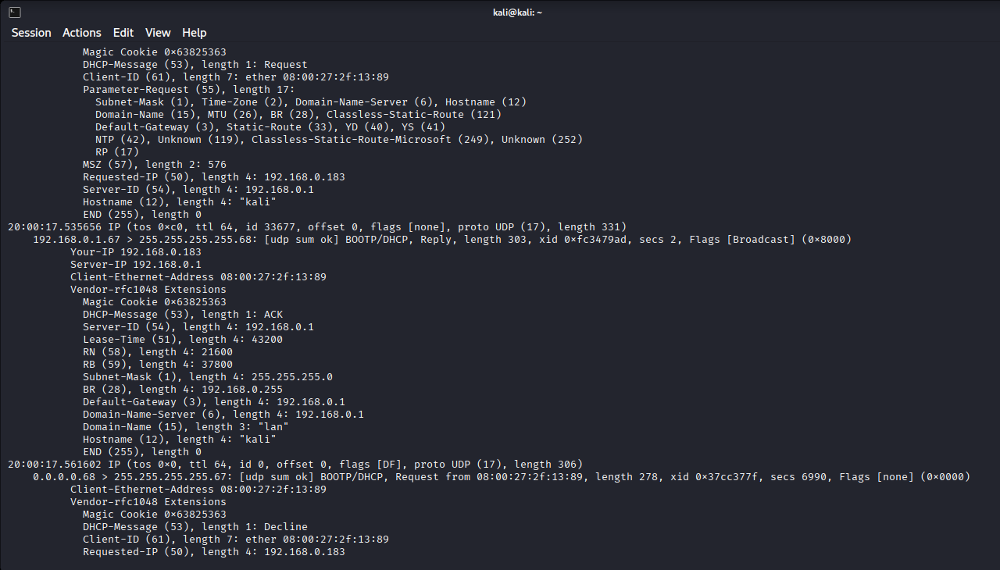
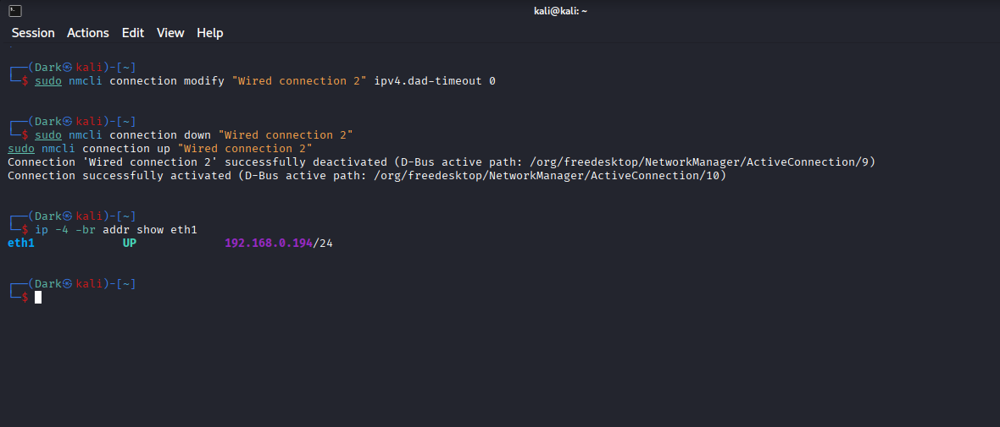
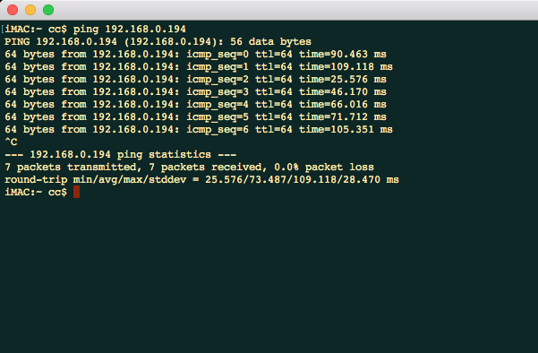
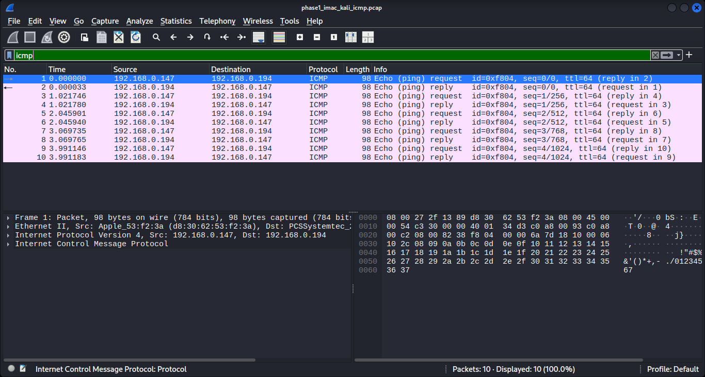

# Phase 01 — Lab Architecture & Network Preparation

> **Physical Endpoint → Bridged Kali Sensor → DHCP Troubleshooting → ICMP Validation → Preserved PCAP Evidence**

---

## Phase Overview

Phase 01 established the network foundation for the **Network Detection & Packet Forensics Home Lab**.

The project was designed around more than isolated virtual machines. A physical endpoint needed to generate real traffic across the local network while a Kali Linux VM captured and analyzed that traffic at packet level.

The first objective was therefore simple but essential:

> **Place Kali directly on the local network, prove that a physical iMac could communicate with it, and preserve packet evidence showing the path worked correctly.**

That setup did not work immediately.

Kali's bridged interface was able to see DHCP and ARP traffic, but it was not retaining a usable IPv4 address. Rather than abandoning bridged networking or assigning a static address immediately, the issue was investigated at packet level.

The troubleshooting sequence eventually showed that DHCP communication itself was occurring, but an offered address was later declined by the client. A NetworkManager IPv4 duplicate-address-detection setting was then adjusted, the connection was recycled, and Kali successfully obtained:

```text
192.168.0.194/24
```

The physical iMac at:

```text
192.168.0.147
```

was then able to communicate with Kali successfully.

The final validation traffic was captured into a PCAP and inspected in Wireshark, establishing a trusted network baseline for every later phase of the project.

---

# Lab Architecture

The project used separate systems for different blue-team roles.

| Role | System | Function |
|---|---|---|
| Physical endpoint | iMac | Generates real endpoint traffic for capture and investigation |
| Virtualization host | MacBook Pro | Runs the analysis VMs and provides the VirtualBox environment |
| Packet-analysis node | Kali Linux VM | Packet capture, Wireshark, TShark, tcpdump and later controlled services |
| Network sensor | Ubuntu VM | Introduced later for Zeek and Suricata processing |

The Phase 01 communication path was:

```text
Physical iMac
192.168.0.147
      │
      │  Local LAN
      ▼
Bridged Kali VM
eth1: 192.168.0.194/24
```

Kali's `eth1` interface was intentionally placed in **bridged mode** rather than relying only on VirtualBox NAT.

This allowed the VM to behave as a peer on the same LAN as the physical iMac instead of existing only behind the host's virtual NAT boundary.

That design mattered because later phases depended on the iMac generating traffic directly toward services running on Kali while packets were captured from the network-facing interface.

---

# Network Preparation Problem

The first obstacle appeared during bridged-network configuration.

Kali's `eth1` interface was active enough to observe broadcast traffic, but it was not consistently retaining a usable IPv4 lease.

At that point, simply seeing an interface marked `UP` was not sufficient evidence that networking was healthy.

The investigation needed to answer a more specific question:

> **Was DHCP traffic actually reaching the bridged interface, or was the problem occurring before address assignment?**

---

# DHCP Packet-Level Troubleshooting

The first diagnostic step used `tcpdump` to isolate DHCP traffic on `eth1`:

```bash
sudo tcpdump -ni eth1 'udp port 67 or udp port 68'
```

The capture showed repeated client DHCP requests along with DHCP replies visible on the same interface.



This was an important finding.

The evidence showed that:

```text
Kali could transmit DHCP traffic
DHCP traffic was visible on eth1
Replies were reaching the bridged network path
```

Therefore, the problem was not simply:

```text
"the bridged adapter cannot see the LAN"
```

The interface had Layer 2 visibility and was participating in DHCP exchanges.

That narrowed the fault toward **lease acceptance / address activation** rather than total network isolation.

---

# DHCP Decline and Address-Conflict Evidence

The next capture included both DHCP and ARP traffic so the address-allocation process could be inspected in more detail.

A detailed DHCP exchange showed the server acknowledging an address for the Kali client.

The packet output included:

```text
Your-IP: 192.168.0.183
Server-ID: 192.168.0.1
DHCP-Message: ACK
```

However, the client then generated a DHCP message containing:

```text
DHCP-Message: Decline
Requested-IP: 192.168.0.183
```



This changed the troubleshooting hypothesis.

DHCP was not simply failing to answer the client.

Instead, the client was receiving an address and then declining it during the address-activation process.

The evidence was consistent with IPv4 address-conflict / duplicate-address detection interfering with stable lease activation.

Importantly, the packet evidence did **not** prove that another host was genuinely using `192.168.0.183`.

The defensible conclusion was narrower:

> **Kali received a DHCP acknowledgement for an address but subsequently declined that address, pointing toward the client's IPv4 address-conflict-detection path rather than a complete lack of DHCP connectivity.**

This distinction prevented the troubleshooting process from incorrectly blaming the DHCP server or the bridged adapter itself.

---

# NetworkManager Remediation

The configuration change that resolved the issue was applied to Kali's NetworkManager connection profile:

```bash
sudo nmcli connection modify "Wired connection 2" ipv4.dad-timeout 0
```

The connection was then recycled:

```bash
sudo nmcli connection down "Wired connection 2"
sudo nmcli connection up "Wired connection 2"
```

The IPv4 state of `eth1` was checked with:

```bash
ip -4 -br addr show eth1
```

The result was:

```text
eth1    UP    192.168.0.194/24
```



This was the first successful network milestone of the project.

The important sequence was not simply that a command was changed.

The troubleshooting path was:

```text
No stable bridged IPv4 address
        ↓
Observe DHCP at packet level
        ↓
Confirm requests and replies are traversing eth1
        ↓
Inspect detailed DHCP exchange
        ↓
Observe ACK followed by client DHCP Decline
        ↓
Adjust NetworkManager IPv4 DAD timeout
        ↓
Recycle connection
        ↓
eth1 obtains 192.168.0.194/24
```

This turned what initially looked like a generic VirtualBox networking failure into a specific, evidence-driven network diagnosis.

---

# Physical Endpoint Connectivity Validation

Obtaining an address on Kali was only half the requirement.

The actual project architecture depended on a **physical endpoint** communicating with the bridged VM.

From the iMac, connectivity to Kali was tested using:

```bash
ping 192.168.0.194
```

The iMac received replies successfully.

The captured terminal output showed:

```text
7 packets transmitted
7 packets received
0.0% packet loss
```



This proved that the architecture was no longer limited to connectivity inside VirtualBox.

A physical system on the LAN could now communicate directly with the bridged Kali VM.

That capability became the foundation for later HTTP, TLS, DNS, callback-style and blind-investigation traffic generation.

---

# Preserved ICMP Validation Capture

After connectivity had been established, a short ICMP exchange between the iMac and Kali was preserved as packet evidence.

The capture was stored as:

```text
phase1_imac_kali_icmp.pcap
```

SHA-256:

```text
eeb3054d76ef3b427356b0168519243bea39b0d13c492683d37e286c3489c2e6
```

The PCAP was opened in Wireshark and filtered using:

```text
icmp
```

The preserved capture contained ten ICMP packets:

```text
5 Echo Requests
5 Echo Replies
```

Traffic alternated between:

```text
192.168.0.147 → 192.168.0.194
192.168.0.194 → 192.168.0.147
```



The Wireshark view independently confirmed what the endpoint terminal had already shown:

> **The physical iMac and bridged Kali VM had working bidirectional IPv4 connectivity.**

The packet capture also provided the first preserved network artifact for the project rather than relying only on command-line success messages.

---

# Why This Phase Mattered

Phase 01 was not just setup work.

Every later investigation depended on the assumptions established here.

If the bridged network path had not been validated first, later findings could have been confused by:

- VirtualBox NAT behavior;
- failed routing between physical and virtual systems;
- unstable DHCP state;
- missing traffic visibility;
- incorrect interface selection; or
- capture problems unrelated to the investigation itself.

By resolving those issues before generating security-focused traffic, later phases could treat the network path as a known-good baseline.

The project therefore moved forward with a simple trust chain:

```text
Bridged interface working
        ↓
Physical endpoint reachable
        ↓
Bidirectional packets visible
        ↓
PCAP preserved
        ↓
Known-good network foundation
```

---

# What the Evidence Proved

Phase 01 evidence supported the following conclusions:

- Kali's bridged `eth1` interface could observe DHCP traffic on the physical LAN.
- DHCP requests and replies were traversing the interface.
- Kali received a DHCP acknowledgement during troubleshooting.
- The client subsequently issued a DHCP Decline for the offered address shown in the diagnostic capture.
- Adjusting the NetworkManager IPv4 DAD timeout and recycling the connection resulted in `eth1` receiving `192.168.0.194/24`.
- The physical iMac at `192.168.0.147` could reach Kali at `192.168.0.194`.
- The iMac connectivity test completed with zero packet loss in the captured terminal session.
- The preserved ICMP PCAP contained bidirectional Echo Request / Echo Reply traffic between the two systems.
- Wireshark independently confirmed five request/reply pairs in the preserved validation capture.
- The validation PCAP was preserved with a SHA-256 hash for later integrity checking.

---

# What the Evidence Did NOT Prove

The Phase 01 evidence did not justify several stronger claims.

It did **not** prove:

- that another host definitely owned the declined DHCP address;
- that the DHCP server itself was faulty;
- that the network contained a rogue DHCP service;
- that all future application protocols would work automatically;
- that every later packet would be visible without validating the correct capture interface; or
- that security detections were functioning.

Those questions were outside the scope of Phase 01.

The goal here was to establish and validate the network path before moving into application baselines and security telemetry.

---

# Skills Demonstrated

Phase 01 exercised the following skills:

- VirtualBox bridged-network design
- Physical-to-virtual network integration
- Linux interface troubleshooting
- NetworkManager configuration with `nmcli`
- DHCP troubleshooting
- DHCP request / acknowledgement / decline interpretation
- ARP observation
- IPv4 duplicate-address-detection troubleshooting
- `tcpdump` capture filtering
- ICMP connectivity validation
- Wireshark packet analysis
- Source / destination IP interpretation
- Packet-level verification of command-line results
- PCAP evidence preservation
- SHA-256 integrity tracking
- Evidence-driven troubleshooting

---

# Analyst Study Notes

### Interface UP does not mean networking is healthy

An interface can be operational at Layer 2 while still failing to retain a usable Layer 3 address.

That is why packet capture was more useful than repeatedly checking whether `eth1` simply appeared as `UP`.

---

### DHCP replies prove more than repeated connection retries

Seeing DHCP replies on the interface showed that the client was not completely isolated from the LAN.

That immediately narrowed the fault domain.

```text
No DHCP visibility
→ investigate adapter / bridge / LAN path

DHCP requests + replies visible
→ investigate lease acceptance / address activation
```

---

### A DHCP Decline changes the hypothesis

A server acknowledgement followed by a client decline is very different from receiving no server response.

The client had progressed further through address assignment before rejecting the address.

This is why reading the actual protocol exchange was more useful than treating the symptom as a generic "DHCP failed" problem.

---

### Validate from both ends

A successful IP address on Kali did not prove the physical endpoint could reach it.

The iMac ping validated the endpoint perspective, while Wireshark validated the packet perspective.

That produced stronger evidence than either test alone.

---

### Preserve a known-good baseline

The first PCAP in the project contained intentionally simple ICMP traffic.

That capture became a reference point for what normal, successful endpoint-to-Kali communication looked like before more complex HTTP, TLS and suspicious traffic was introduced.

---

# Interview Talking Point

A concise way to explain Phase 01 in an interview:

> I built the lab so a physical endpoint could communicate directly with a bridged Kali VM rather than keeping all traffic inside isolated VMs. The bridged interface initially would not retain a DHCP address, so I used tcpdump to verify DHCP and ARP activity instead of guessing. I confirmed that replies were reaching the interface and later observed a DHCP ACK followed by a client DHCP Decline, which pointed toward the IPv4 duplicate-address-detection path. After adjusting NetworkManager's DAD timeout and recycling the connection, Kali obtained a valid LAN address. I then validated physical iMac-to-Kali connectivity and preserved the ICMP exchange in a hashed PCAP that I inspected in Wireshark.

---

# Phase 01 Result

**Lab Architecture & Network Preparation: COMPLETE**

```text
Physical endpoint selected          ✅
Bridged Kali interface configured   ✅
DHCP failure investigated           ✅
Packet-level DHCP evidence captured ✅
Client DHCP Decline identified      ✅
NetworkManager remediation applied  ✅
Kali LAN address obtained           ✅
iMac → Kali connectivity validated  ✅
ICMP PCAP preserved                 ✅
Wireshark validation completed      ✅
SHA-256 evidence recorded           ✅
```

Phase 01 established the working network foundation required for the rest of the project.

The next phase could therefore move from basic reachability into **known-good HTTP and TLS baseline traffic**, with confidence that the underlying physical-to-virtual network path had already been tested and preserved as evidence.
