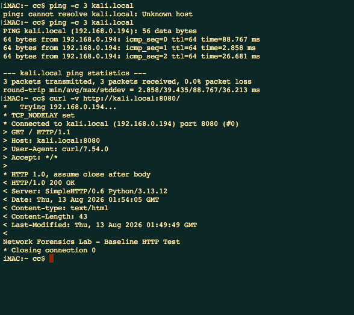
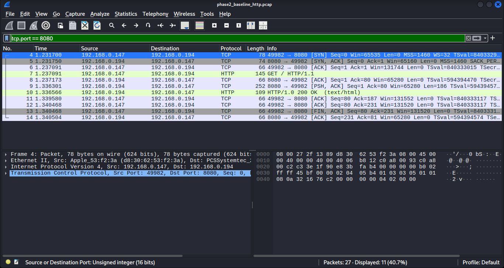
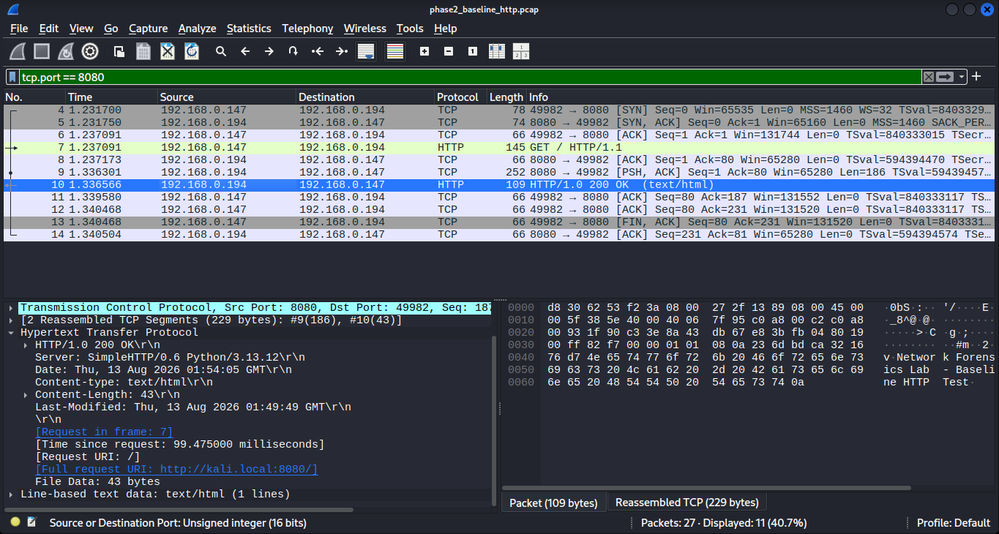
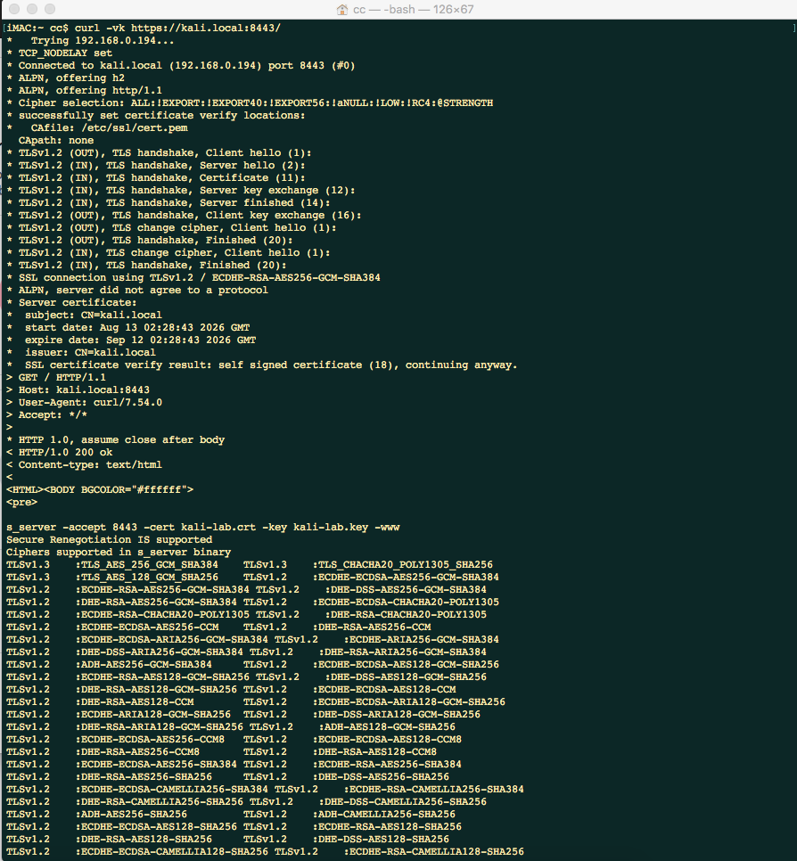
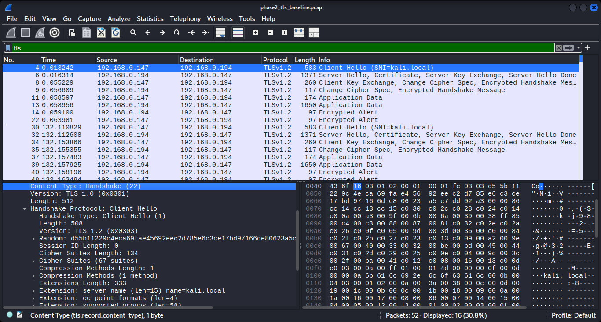
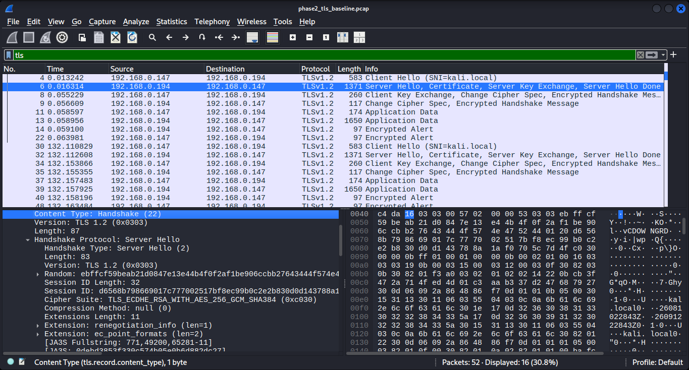
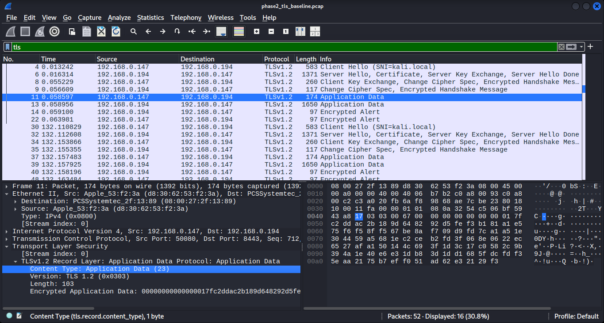

# Phase 02 — Baseline Packet Analysis

> **Known-Good HTTP → Plaintext Visibility → TLS Handshake Metadata → Encrypted Application Data → Analyst Baseline**

---

## Phase Overview

Phase 02 established the project’s **known-good application traffic baseline**.

After Phase 01 proved that the physical iMac and bridged Kali VM could communicate reliably, the next objective was to understand what normal HTTP and TLS traffic looked like at packet level before introducing Zeek, Suricata, beaconing behavior, suspicious requests, or blind investigations.

The core question was:

> **What can an analyst see directly in unencrypted HTTP traffic, and what remains visible once the same communication is protected by TLS?**

Two controlled baselines were generated from the physical iMac toward services on Kali:

```text
HTTP  → kali.local:8080
TLS   → kali.local:8443
```

The HTTP capture demonstrated full plaintext visibility into request, response, headers, server identity, status code, and response body.

The TLS capture showed a very different visibility model. The application payload became encrypted, but useful metadata remained observable, including IP addresses, ports, handshake structure, SNI, negotiated protocol version, cipher suite, packet sizes, timing, and direction.

This phase created the reference point used throughout the rest of the project:

```text
Normal traffic first
        ↓
Understand expected packet structure
        ↓
Introduce telemetry and detections later
        ↓
Compare suspicious behavior against a known baseline
```

---

# Baseline Environment

| Role | System | Address / Function |
|---|---|---|
| Physical endpoint | iMac | `192.168.0.147` |
| Baseline service host | Kali Linux VM | `192.168.0.194` |
| HTTP service | Kali | TCP/8080 |
| TLS service | Kali | TCP/8443 |
| Packet-analysis workstation | Kali | Wireshark / packet inspection |

The communication path was:

```text
Physical iMac
192.168.0.147
      │
      │ HTTP / TLS
      ▼
Kali Linux VM
192.168.0.194
```

The Phase 02 tests intentionally used controlled traffic with known expected behavior.

That made it possible to distinguish normal protocol structure from genuinely unusual behavior in later phases.

---

# HTTP Baseline Generation

A simple HTTP service was exposed from Kali on TCP/8080.

From the iMac, the service was accessed using:

```bash
curl -v http://kali.local:8080/
```

The endpoint resolved:

```text
kali.local → 192.168.0.194
```

and connected to TCP/8080 successfully.

The response returned:

```text
HTTP/1.0 200 OK
Server: SimpleHTTP/0.6 Python/3.13.12
Content-Type: text/html
Content-Length: 43
```

The body contained:

```text
Network Forensics Lab - Baseline HTTP Test
```



This established a known-good application transaction before packet analysis began.

---

# HTTP Packet Flow

The corresponding capture was stored as:

```text
phase2_baseline_http.pcap
```

SHA-256:

```text
34d1676b7bb3280182266f8dcab9e4be5addb7110e98916cee2a61d8f04e98d3
```

Wireshark was filtered for the HTTP service using:

```text
tcp.port == 8080
```

The capture clearly showed the full TCP and HTTP transaction:

```text
192.168.0.147:49982 → 192.168.0.194:8080  SYN
192.168.0.194:8080  → 192.168.0.147:49982 SYN/ACK
192.168.0.147:49982 → 192.168.0.194:8080  ACK
192.168.0.147       → 192.168.0.194       HTTP GET /
192.168.0.194       → 192.168.0.147       HTTP/1.0 200 OK
```



This created an important baseline lesson:

> **Unencrypted HTTP exposes the application transaction directly to packet inspection.**

The analyst could identify not only that a connection occurred, but exactly what resource was requested and how the server responded.

---

# HTTP Response Reconstruction

The response packet was inspected in detail.

Wireshark reconstructed:

```text
HTTP/1.0 200 OK
Server: SimpleHTTP/0.6 Python/3.13.12
Content-Type: text/html
Content-Length: 43
```

The request URI was also linked back to:

```text
http://kali.local:8080/
```

and the 43-byte response body remained readable directly from the packet stream.



The HTTP baseline therefore exposed all of the following to packet analysis:

```text
Source IP
Destination IP
Source port
Destination port
HTTP method
Requested URI
Host value
Server software
Status code
Content type
Content length
Response body
```

This level of visibility became the comparison point for the TLS baseline.

---

# TLS Baseline Generation

The second baseline introduced encryption.

A controlled TLS service was exposed from Kali on TCP/8443 using a self-signed certificate for:

```text
kali.local
```

From the iMac, the service was accessed using:

```bash
curl -vk https://kali.local:8443/
```

The terminal output showed a successful TLS connection using:

```text
TLSv1.2
ECDHE-RSA-AES256-GCM-SHA384
```

The certificate subject was:

```text
CN=kali.local
```

and the certificate was self-signed for controlled lab use.



The command-line output confirmed that the application request succeeded, but the key Phase 02 question was what the network capture could still reveal without decrypting the TLS session.

---

# TLS Evidence Preservation

The encrypted baseline was captured as:

```text
phase2_tls_baseline.pcap
```

SHA-256:

```text
603a0e49487601906a2274598f702b20da50a1185b13c1e88751725963f39f92
```

The capture contained the TLS handshake followed by encrypted application traffic between:

```text
192.168.0.147
        ↕
192.168.0.194:8443
```

Unlike the HTTP baseline, packet inspection no longer exposed the application request or response body directly.

However, encryption did **not** make the connection invisible.

---

# TLS Client Hello — SNI Remains Visible

The TLS Client Hello was inspected first.

Wireshark identified:

```text
Handshake Type: Client Hello
Version: TLS 1.2
```

and the Server Name Indication extension exposed:

```text
kali.local
```



This demonstrated an important network-analysis principle:

> **Encrypted application content can coexist with visible connection metadata.**

Even without decrypting the payload, the capture still revealed that the iMac was attempting a TLS session associated with `kali.local`.

The packet also preserved other handshake metadata such as:

```text
Client IP
Server IP
Destination port
TLS handshake type
Cipher-suite offerings
Extensions
SNI
Packet size
Timestamp
```

This kind of metadata later becomes highly useful during threat hunting and behavioral analysis.

---

# TLS Server Hello — Negotiated Session Parameters

The server’s response was then inspected.

The Server Hello showed:

```text
Version: TLS 1.2
Cipher Suite: TLS_ECDHE_RSA_WITH_AES_256_GCM_SHA384
```



This confirmed the negotiated session characteristics independently from the endpoint terminal output.

The key point was that the analyst could still determine **how** the encrypted session was established even though the later application data was no longer readable.

Visible TLS metadata therefore included both client-side intent and server-side negotiation.

---

# Understanding the TLS Version Fields

One subtle detail in packet analysis was important enough to document explicitly.

Some TLS record-layer fields displayed a legacy value such as:

```text
TLS 1.0 (0x0301)
```

while the actual handshake and negotiated session were TLS 1.2.

The correct interpretation for this capture came from the handshake metadata and endpoint output:

```text
Negotiated session: TLS 1.2
```

The record-layer compatibility value should therefore **not** be misreported as proof that the session itself negotiated TLS 1.0.

This was a useful analyst lesson:

> **Protocol fields must be interpreted in context rather than read as isolated labels.**

---

# Encrypted Application Data

After the TLS handshake completed, subsequent packets were identified as:

```text
Application Data
```

Wireshark showed the encrypted record contents as opaque bytes rather than reconstructing the HTTP request or response body.



The plaintext HTTP baseline had exposed:

```text
GET /
HTTP 200
Server header
Content-Type
Response body
```

The encrypted TLS baseline did not expose those application details directly from the network capture.

Instead, packet analysis retained metadata such as:

```text
Who communicated
When they communicated
Which ports were used
How much data moved
Which direction it moved
TLS handshake details
SNI
Negotiated TLS version
Negotiated cipher suite
Connection timing
```

This distinction became one of the foundational ideas for the entire project.

---

# HTTP vs TLS Visibility Comparison

The two controlled captures provided a clean comparison.

| Evidence | HTTP baseline | TLS baseline |
|---|---:|---:|
| Source / destination IP | Visible | Visible |
| Source / destination port | Visible | Visible |
| TCP behavior | Visible | Visible |
| Timing | Visible | Visible |
| Packet / byte sizes | Visible | Visible |
| HTTP method | Visible | Not directly visible after encryption |
| URI / path | Visible | Not directly visible after encryption |
| Status code | Visible | Not directly visible after encryption |
| Response body | Visible | Encrypted |
| TLS handshake | N/A | Visible |
| SNI | N/A | Visible in this capture |
| Negotiated TLS version | N/A | Visible |
| Negotiated cipher suite | N/A | Visible |

The result can be summarized as:

```text
HTTP
→ application content + metadata visible

TLS
→ application content encrypted
→ substantial connection metadata still visible
```

That difference explains why network defenders can still perform useful analysis on encrypted traffic even when payload inspection is unavailable.

---

# Why Baselines Matter

The purpose of Phase 02 was not to find an attack.

It was to establish what **normal successful communication** looked like before later phases introduced suspicious behavior.

Without this baseline, later observations such as repeated connections, unusual ports, uncommon User-Agents, DNS periodicity, encrypted callbacks, or abnormal request paths would have less context.

The baseline created a reference model:

```text
Known endpoint
Known destination
Known service
Known protocol
Known expected outcome
        ↓
Observe packet characteristics
        ↓
Use those characteristics as comparison points later
```

This is especially important in threat hunting because suspiciousness often comes from deviation from expected behavior rather than a single packet being inherently malicious.

---

# What the Evidence Proved

Phase 02 evidence supported the following conclusions:

- The physical iMac successfully communicated with Kali over HTTP on TCP/8080.
- The HTTP request was sent from `192.168.0.147` to `192.168.0.194`.
- The HTTP transaction completed successfully with `HTTP/1.0 200 OK`.
- The HTTP server identified itself as `SimpleHTTP/0.6 Python/3.13.12`.
- The HTTP response body was visible directly in packet data because the traffic was unencrypted.
- The physical iMac successfully established a TLS session with Kali on TCP/8443.
- The TLS session negotiated TLS 1.2.
- The negotiated cipher suite was `TLS_ECDHE_RSA_WITH_AES_256_GCM_SHA384`.
- The Client Hello exposed the SNI value `kali.local` in the preserved capture.
- TLS application data was encrypted and not directly readable as HTTP content in the packet capture.
- Source and destination addressing, ports, timing, packet sizes, direction, and handshake metadata remained visible despite payload encryption.
- Both baseline PCAPs were preserved with SHA-256 hashes.

---

# What the Evidence Did NOT Prove

The Phase 02 evidence did **not** prove:

- that the HTTP traffic was malicious;
- that the TLS traffic was suspicious;
- that encryption hides all metadata;
- that every TLS session will expose identical metadata;
- that the encrypted application payload could be reconstructed without decryption material;
- that a visible SNI value alone indicates malicious activity;
- that a self-signed lab certificate would be trusted in a production environment; or
- that packet visibility automatically produces a security alert.

Phase 02 was intentionally a **known-good baseline**, not a detection exercise.

---

# Skills Demonstrated

Phase 02 exercised the following skills:

- Controlled network-traffic generation
- HTTP request / response analysis
- TCP session interpretation
- Wireshark display filtering
- Packet-level HTTP reconstruction
- HTTP header analysis
- Server fingerprint observation
- TLS handshake analysis
- Client Hello analysis
- Server Hello analysis
- SNI identification
- Cipher-suite interpretation
- TLS version interpretation
- Encrypted application-data recognition
- Metadata-vs-payload reasoning
- PCAP evidence preservation
- SHA-256 integrity tracking
- Baseline creation for later threat hunting

---

# Analyst Study Notes

### Plaintext protocols expose application intent directly

With HTTP, packet analysis can often show exactly what resource was requested and what the server returned.

In this baseline:

```text
GET /
→ HTTP 200
→ readable headers
→ readable response body
```

That makes HTTP traffic highly transparent to packet-level investigation.

---

### Encryption changes visibility — it does not remove visibility

After TLS encryption begins, the application payload becomes opaque.

But the network still reveals a behavioral shell around the session:

```text
source
 destination
 ports
 timing
 packet sizes
 connection direction
 handshake metadata
 SNI
 TLS parameters
```

This is why encrypted traffic can still support behavioral threat hunting.

---

### SNI is metadata, not payload content

The Client Hello exposed:

```text
kali.local
```

before application data became encrypted.

That value helped identify the intended server name without exposing the later HTTP content carried inside TLS.

---

### Server Hello identifies negotiated parameters

The Client Hello contains what the client offers.

The Server Hello shows what the session actually selected.

For this baseline:

```text
TLS 1.2
TLS_ECDHE_RSA_WITH_AES_256_GCM_SHA384
```

This distinction matters when interpreting handshake captures.

---

### Do not confuse record-layer compatibility fields with the negotiated session

A packet may contain a legacy TLS record-layer version value while the handshake negotiates a newer protocol version.

The correct conclusion must come from the full protocol context rather than one isolated field.

---

### Baselines make later anomalies meaningful

A normal connection by itself is not a detection.

But once normal behavior has been observed, later questions become easier to answer:

```text
Is this port expected?
Is this destination normal?
Is this connection repeating unusually?
Is the timing regular?
Is the hostname expected?
Is the request pattern normal?
```

Phase 02 established the reference needed to ask those questions later.

---

# Interview Talking Point

A concise way to explain Phase 02 in an interview:

> After validating the network architecture, I generated controlled HTTP and TLS traffic from a physical iMac to services on my Kali VM and analyzed both captures in Wireshark. The HTTP baseline let me reconstruct the full request and response, including the URI, HTTP 200 status, server header, content length, and body. I then repeated the exercise over TLS and compared what changed. The application data became encrypted, but I could still analyze the Client Hello, SNI, Server Hello, TLS version, cipher suite, IPs, ports, timing, and packet sizes. That gave me a known-good baseline for distinguishing payload visibility from metadata visibility before I moved into Zeek, Suricata, and suspicious traffic investigations.

---

# Phase 02 Result

**Baseline Packet Analysis: COMPLETE**

```text
Physical HTTP traffic generated      ✅
HTTP PCAP preserved                   ✅
TCP/HTTP flow reconstructed           ✅
HTTP 200 response validated           ✅
Plaintext response body observed      ✅
Physical TLS traffic generated        ✅
TLS PCAP preserved                    ✅
Client Hello analyzed                 ✅
SNI identified                        ✅
Server Hello analyzed                 ✅
TLS 1.2 negotiation confirmed         ✅
Cipher suite identified               ✅
Encrypted application data confirmed  ✅
HTTP vs TLS visibility compared       ✅
SHA-256 evidence recorded             ✅
```

Phase 02 established the project’s known-good application baseline.

The next phase could therefore introduce **Zeek and Suricata** and ask a more advanced question:

> **How do structured network telemetry and IDS logic represent the same traffic that was first understood manually at packet level?**
