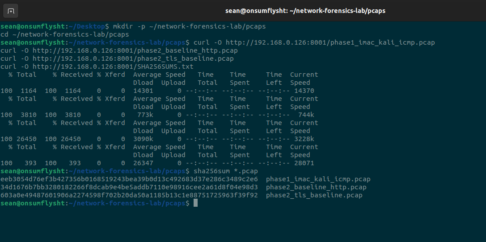
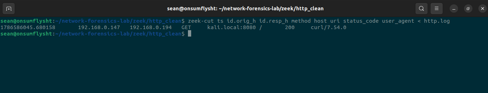
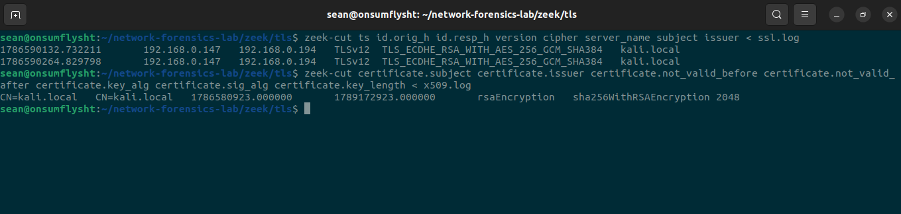
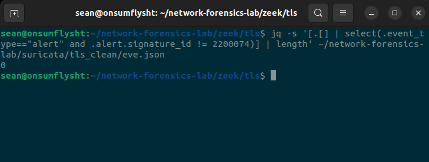
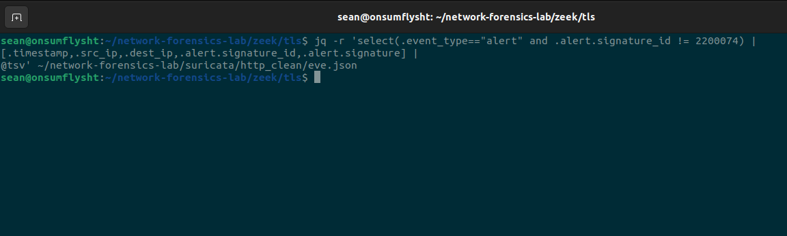

# Phase 03 — Zeek & Suricata Telemetry

> **Preserved PCAPs → Integrity Verification → Zeek Protocol Telemetry → Suricata IDS Analysis → Telemetry vs Detection**

---

## Phase Overview

Phase 03 transformed the project from manual packet inspection into a small network-monitoring pipeline.

Phase 01 established a working physical-to-virtual network path. Phase 02 then created known-good HTTP and TLS captures and documented what Wireshark could observe directly from raw packets.

The next question was:

> **Can the same preserved traffic be converted into structured network telemetry and processed through an IDS without losing the evidence trail?**

To answer that, the Phase 01 and Phase 02 PCAPs were transferred to an Ubuntu sensor and processed with:

```text
Zeek 7.0.11
Suricata 8.0.6
```

Zeek was used to convert packet-level activity into analyst-friendly protocol logs.

Suricata was used to evaluate the same traffic through an IDS ruleset and determine whether normal baseline activity generated meaningful security alerts.

The result introduced one of the most important ideas used throughout the rest of the project:

> **Telemetry and detection are different layers. A sensor can describe activity in detail without deciding that the activity is malicious.**

---

# Sensor Role

The Ubuntu VM was introduced as a dedicated offline network-analysis sensor.

The project roles now looked like this:

| Role | System | Function |
|---|---|---|
| Physical endpoint | iMac | Generates controlled traffic |
| Packet capture / manual analysis | Kali Linux | Captures PCAPs and performs Wireshark/TShark analysis |
| Evidence transfer bridge | MacBook host | Moves preserved PCAPs between VMs when required |
| Network telemetry / IDS sensor | Ubuntu VM | Zeek and Suricata offline processing |

The analysis path became:

```text
Physical endpoint activity
        ↓
Kali packet capture
        ↓
Preserved PCAP
        ↓
SHA-256 verification
        ↓
Ubuntu sensor
   ├── Zeek
   └── Suricata
```

This separation meant the evidence did not need to be regenerated for every tool.

The exact same capture could be inspected manually, converted into Zeek logs, and replayed through Suricata.

---

# Evidence Transfer and Integrity Verification

Before the Phase 02 captures were processed on Ubuntu, the PCAPs were transferred from the capture environment to the sensor.

The transferred evidence included:

```text
phase1_imac_kali_icmp.pcap
phase2_baseline_http.pcap
phase2_tls_baseline.pcap
```

The original SHA-256 values were:

```text
phase1_imac_kali_icmp.pcap
  eeb3054d76ef3b427356b0168519243bea39b0d13c492683d37e286c3489c2e6

phase2_baseline_http.pcap
  34d1676b7bb3280182266f8dcab9e4be5addb7110e98916cee2a61d8f04e98d3

phase2_tls_baseline.pcap
  603a0e49487601906a2274598f702b20da50a1185b13c1e88751725963f39f92
```

After transfer, the files were hashed again on Ubuntu using:

```bash
sha256sum *.pcap
```

The calculated values matched the original capture hashes.



This established a basic evidence-integrity chain:

```text
Original capture
      ↓
SHA-256 recorded
      ↓
PCAP transferred
      ↓
SHA-256 recalculated
      ↓
MATCH
```

That mattered because the goal was not merely to make Zeek and Suricata produce output.

The goal was to demonstrate that both tools were processing the **same preserved network evidence** already investigated in earlier phases.

---

# Zeek Processing Model

Wireshark is excellent for packet-level reconstruction, but an analyst does not always want to manually inspect every frame.

Zeek adds another layer by converting network activity into structured logs such as:

```text
conn.log
http.log
ssl.log
x509.log
dns.log
```

Instead of starting with individual packet fields, an analyst can query higher-level records describing conversations, protocols, requests and metadata.

For this project, Phase 03 focused on two baseline captures:

```text
HTTP baseline
TLS baseline
```

---

# Zeek HTTP Telemetry

The HTTP baseline capture was processed through Zeek.

An initial offline run produced checksum-related warnings caused by capture/offload artifacts from the virtualized environment.

To avoid allowing invalid captured checksums to prevent protocol analysis, the PCAP was reprocessed using Zeek's checksum-ignore option:

```bash
zeek -C -r phase2_baseline_http.pcap
```

The resulting `http.log` was queried using `zeek-cut`:

```bash
zeek-cut ts id.orig_h id.resp_h method host uri status_code user_agent < http.log
```

Zeek reconstructed the HTTP transaction as:

```text
192.168.0.147 → 192.168.0.194
GET
Host: kali.local:8080
URI: /
Status: 200
User-Agent: curl/7.54.0
```



This independently matched the Phase 02 Wireshark investigation.

The raw packet analysis had shown:

```text
GET /
Host: kali.local:8080
HTTP 200 OK
curl/7.54.0
```

Zeek converted those packet-level observations into one concise structured record.

That demonstrated an important analyst workflow:

```text
Raw PCAP
   ↓
Wireshark reconstruction
   ↓
Zeek structured telemetry
   ↓
Same network event
```

The tools were not competing sources of truth.

They were different views of the same evidence.

---

# Zeek TLS Telemetry

The TLS baseline was then processed through Zeek.

Phase 02 had already established that TLS protected the application payload while still exposing useful handshake metadata.

Zeek made that metadata easier to query at scale.

The TLS log was queried for fields including:

```text
ts
id.orig_h
id.resp_h
version
cipher
server_name
subject
issuer
```

The resulting session records showed:

```text
192.168.0.147 → 192.168.0.194
TLSv12
TLS_ECDHE_RSA_WITH_AES_256_GCM_SHA384
server_name: kali.local
```

The accompanying X.509 log showed certificate metadata including:

```text
Subject: CN=kali.local
Issuer:  CN=kali.local
Key algorithm: rsaEncryption
Signature algorithm: sha256WithRSAEncryption
Key length: 2048
```



This reinforced the Phase 02 visibility lesson.

Even though application content was encrypted, the network still exposed useful metadata such as:

```text
who communicated
which server name was requested
which TLS version was negotiated
which cipher suite was used
certificate identity
certificate key properties
```

That metadata later became important when investigating encrypted callback-style traffic.

---

# Zeek as an Analyst Enrichment Layer

Phase 03 showed why Zeek is useful for investigations.

A packet capture may contain everything needed to answer a question, but the analyst must often reconstruct the relevant fields manually.

Zeek performs much of that protocol parsing in advance.

For example:

```text
Wireshark
→ individual packets
→ TCP streams
→ request and response fields

Zeek
→ one structured HTTP record
→ one structured TLS session
→ certificate metadata
```

This does not make packet analysis unnecessary.

Instead, it provides a faster pivot layer.

An analyst can identify interesting activity in Zeek and return to the raw PCAP when deeper validation is required.

That workflow became central in the later investigations.

---

# Suricata IDS Processing

The same baseline PCAPs were also replayed through Suricata.

Suricata had been installed on the Ubuntu sensor and its ruleset updated before analysis.

The active environment loaded hundreds of signatures, allowing the project to compare normal traffic against an IDS detection layer.

Offline replay used the preserved PCAPs rather than regenerating traffic.

Because the captures contained checksum-offloading artifacts, Suricata replay used:

```text
-k none
```

This prevented checksum validation from blocking normal offline analysis.

However, an important distinction appeared:

> **Disabling engine checksum validation does not automatically remove every checksum-related rule alert from the IDS output.**

A known Suricata checksum signature still appeared in the baseline environment:

```text
SID 2200074
SURICATA TCPv4 invalid checksum
```

That alert was treated as a capture artifact rather than a security event.

For meaningful detection review, the known checksum SID was excluded from alert counts.

---

# Suricata TLS Baseline Result

The TLS replay output was queried for alerts while excluding the known checksum artifact.

The resulting meaningful-alert count was:

```text
0
```



This result was expected for the controlled baseline.

The TLS session was visible and parseable, but the traffic itself represented a known-good lab connection.

Therefore the correct interpretation was not:

```text
Suricata saw nothing
```

It was:

```text
The baseline traffic produced no meaningful IDS alert after known capture-artifact noise was excluded.
```

Those statements are very different.

---

# Suricata HTTP Baseline Result

The HTTP baseline was reviewed in the same way.

After excluding the known checksum artifact, the HTTP capture also produced no meaningful IDS alert.



Again, this did not mean the traffic was invisible.

The HTTP session had already been reconstructed in both Wireshark and Zeek.

The result simply showed that normal baseline activity did not match a relevant security signature in the active Suricata ruleset.

---

# Telemetry Is Not Detection

Phase 03 established a distinction that became one of the core ideas of the entire project.

Consider the HTTP baseline:

```text
Traffic exists?            YES
Packets captured?          YES
HTTP reconstructed?        YES
Zeek telemetry generated?  YES
Meaningful IDS alert?      NO
```

The absence of an alert does not automatically mean the sensor failed.

For a known-good baseline, no meaningful alert may be exactly the expected result.

This can be expressed as:

```text
Visibility
   ≠
Detection
   ≠
Maliciousness
```

A monitoring stack has multiple layers:

```text
PACKETS
   ↓
PROTOCOL PARSING
   ↓
TELEMETRY
   ↓
DETECTION LOGIC
   ↓
ALERT
   ↓
ANALYST INTERPRETATION
```

Failure at one layer should not automatically be blamed on another.

That model later became essential when the project encountered traffic that was clearly visible to Suricata but still did not generate the desired detection.

---

# Baseline Comparison

The Phase 02 and Phase 03 work can be summarized as follows:

| Evidence layer | HTTP baseline | TLS baseline |
|---|---|---|
| Raw packets | Visible | Visible |
| Application payload | Plaintext | Encrypted after handshake |
| Wireshark protocol analysis | Full request/response visibility | Handshake + metadata + encrypted Application Data |
| Zeek structured telemetry | Method, host, URI, status, User-Agent | Version, cipher, server name, certificate metadata |
| Suricata meaningful alert | None | None |

This table became the known-good reference for later investigations.

The project now knew what normal HTTP and TLS looked like at three different layers:

```text
Wireshark
Zeek
Suricata
```

---

# Why This Phase Mattered

Without Phase 03, later investigations could have produced ambiguous results.

For example, if suspicious traffic generated no alert, several explanations would be possible:

```text
Was the PCAP corrupted?
Did the transfer modify the evidence?
Could Zeek parse the protocol?
Could Suricata process the PCAP?
Was checksum noise interfering?
Was the traffic visible but simply not covered by a rule?
```

Phase 03 answered the foundational questions first.

The project demonstrated that:

```text
PCAP integrity could be verified
Zeek could reconstruct HTTP
Zeek could extract TLS/X.509 metadata
Suricata could process the captures
checksum artifacts could be identified and separated
normal baseline traffic produced no meaningful security alert
```

That gave the later investigations a trusted telemetry pipeline.

---

# What the Evidence Proved

Phase 03 evidence supported the following conclusions:

- The Phase 01 and Phase 02 PCAPs reached Ubuntu with matching SHA-256 hashes.
- The HTTP baseline could be parsed by Zeek into structured HTTP telemetry.
- Zeek reconstructed the iMac-to-Kali HTTP request and its HTTP 200 status.
- Zeek preserved useful application metadata including host, URI and User-Agent.
- The TLS baseline could be parsed into structured TLS metadata.
- Zeek identified the session as TLS 1.2.
- Zeek recorded the negotiated cipher as `TLS_ECDHE_RSA_WITH_AES_256_GCM_SHA384`.
- Zeek recorded the server name `kali.local`.
- Zeek extracted X.509 metadata including the `CN=kali.local` subject/issuer and a 2048-bit RSA key.
- The known checksum alert could be distinguished from meaningful IDS detections.
- After excluding known checksum noise, the TLS baseline produced zero meaningful Suricata alerts.
- After excluding known checksum noise, the HTTP baseline produced zero meaningful Suricata alerts.

---

# What the Evidence Did NOT Prove

The Phase 03 evidence did **not** prove:

- that Zeek or Suricata would detect every malicious network behavior;
- that zero alerts means zero visibility;
- that encrypted TLS payload contents were readable from the PCAP;
- that every checksum warning indicates malicious packet manipulation;
- that a parsed protocol event automatically deserves an alert;
- that all active Suricata signatures were relevant to the lab's later detection objectives; or
- that an IDS ruleset had complete behavioral coverage.

Those distinctions became important in the investigation phases that followed.

---

# Skills Demonstrated

Phase 03 exercised the following skills:

- Network sensor architecture
- PCAP evidence transfer
- SHA-256 evidence integrity verification
- Offline packet replay
- Zeek installation and configuration
- Zeek PCAP processing
- `zeek-cut` field extraction
- `http.log` analysis
- `ssl.log` analysis
- `x509.log` analysis
- HTTP telemetry interpretation
- TLS metadata analysis
- X.509 certificate analysis
- Cipher-suite interpretation
- Suricata installation and ruleset preparation
- Suricata offline PCAP processing
- EVE JSON alert filtering
- `jq` querying
- Checksum-offload artifact handling
- IDS alert triage
- Baseline validation
- Telemetry-vs-detection reasoning
- Evidence-backed network analysis

---

# Analyst Study Notes

### Structured logs accelerate investigation

Raw packets contain the deepest evidence, but structured telemetry is often faster for first-pass investigation.

Instead of manually rebuilding every HTTP request, Zeek can expose fields such as:

```text
source
response host
method
host
URI
status code
User-Agent
```

The analyst can then return to Wireshark for packet-level proof when necessary.

---

### Encryption does not eliminate network metadata

TLS encrypted the application payload, but useful metadata remained visible.

In the baseline capture, Zeek still extracted:

```text
TLS version
cipher suite
server name
certificate subject
certificate issuer
key algorithm
key length
```

This is why encrypted traffic can still support threat hunting and behavioral investigation.

---

### Checksum artifacts must be interpreted in context

Virtualized capture environments may record packets before or after NIC checksum processing in ways that make offline analyzers report invalid checksums.

The important lesson was not to blindly treat every checksum-related IDS alert as malicious.

The evidence and capture environment must be considered together.

---

### No alert does not mean no telemetry

This became the biggest Phase 03 lesson.

```text
Zeek event exists
Suricata protocol visibility exists
Alert does not fire
```

can be a perfectly valid state.

The analyst must determine whether the event is benign, whether a detection should exist, and whether the active ruleset actually covers it.

---

### Baselines make later anomalies meaningful

A suspicious pattern is easier to defend when normal behavior has already been documented.

Phase 03 established known-good examples of:

```text
normal HTTP telemetry
normal TLS metadata
normal IDS output
```

Later phases could compare unusual behavior against that reference instead of evaluating every event in isolation.

---

# Interview Talking Point

A concise way to explain Phase 03 in an interview:

> I took the PCAPs I had already investigated manually and moved them to a separate Ubuntu sensor, verifying the SHA-256 hashes before analysis. I processed the same evidence through Zeek and Suricata. Zeek converted the HTTP traffic into structured request telemetry and extracted TLS version, cipher, SNI and X.509 certificate metadata from the encrypted baseline. I also had to account for checksum-offload artifacts during offline analysis rather than treating them as security findings. Suricata produced no meaningful alerts for the known-good HTTP and TLS baselines after that noise was excluded. That phase taught me to separate packet visibility, protocol telemetry and detection logic instead of treating them as the same thing.

---

# Phase 03 Result

**Zeek & Suricata Telemetry: COMPLETE**

```text
Ubuntu sensor prepared                 ✅
Preserved PCAPs transferred            ✅
SHA-256 integrity verified             ✅
Zeek HTTP parsing validated            ✅
Zeek HTTP telemetry extracted          ✅
Zeek TLS parsing validated             ✅
TLS version / cipher extracted          ✅
SNI metadata extracted                 ✅
X.509 metadata extracted               ✅
Suricata offline replay completed      ✅
Checksum artifact identified           ✅
HTTP meaningful-alert baseline set     ✅
TLS meaningful-alert baseline set      ✅
Telemetry-vs-detection model established ✅
```

Phase 03 established the monitoring layer required for the investigation stages of the project.

The lab could now move beyond asking only:

```text
What packets were captured?
```

and begin asking:

```text
What behavior does the telemetry reveal?

Did the IDS detect it?

If not, why not?
```

That transition leads directly into **Investigation 01 — BLACK SIGNAL**.
