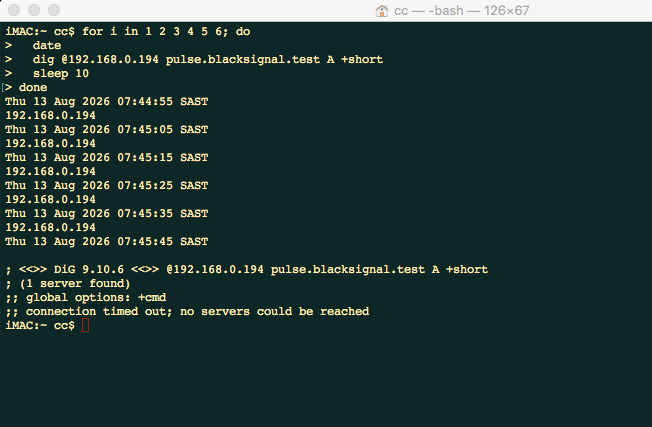
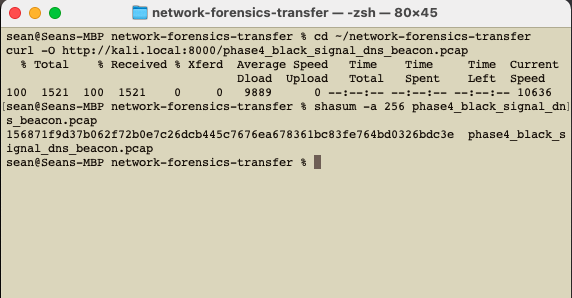
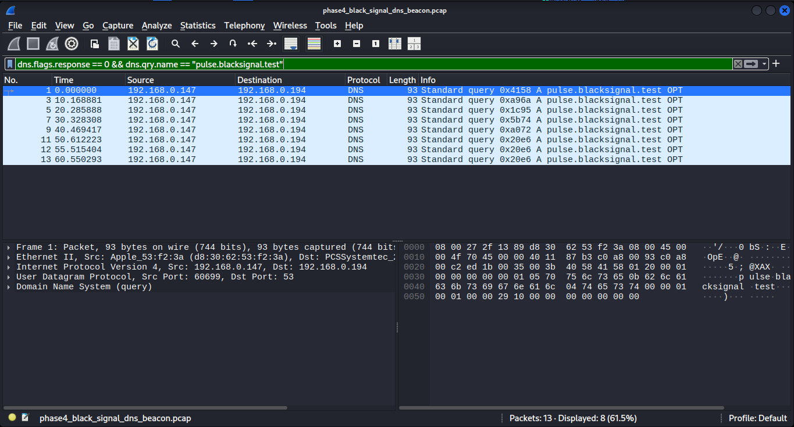
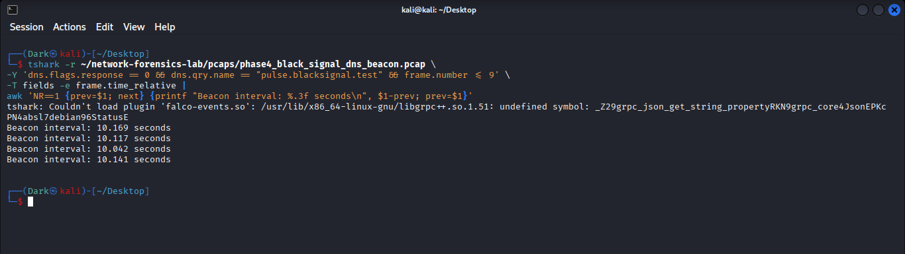
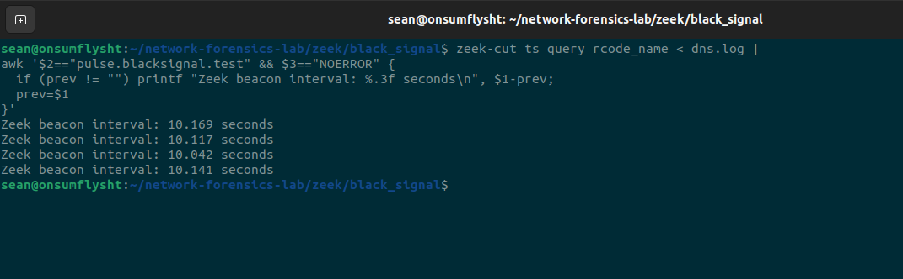
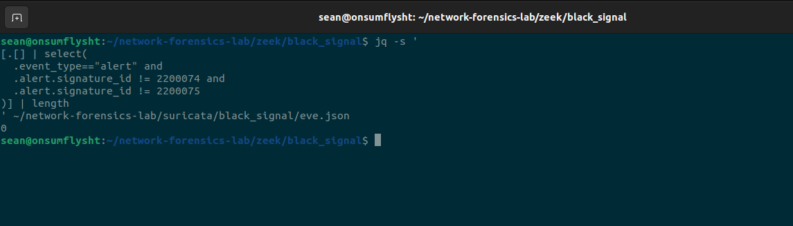

# Phase 04 — Investigation 01: BLACK SIGNAL

> **Periodic DNS Activity → Timing Analysis → Zeek Correlation → Suricata Detection Gap**

---

## Investigation Overview

BLACK SIGNAL was the first investigation-focused phase of the **Network Detection & Packet Forensics Home Lab**.

The previous phases established the network path, built known-good HTTP/TLS baselines, and introduced Zeek and Suricata as network-analysis sensors. Phase 04 moved beyond simple protocol validation and asked a more analyst-oriented question:

> **Can repeated DNS activity that appears normal at the individual-packet level become suspicious when analyzed as a behavior over time?**

To test this, a controlled DNS pattern was generated from the physical iMac endpoint toward the Kali system using the lab-only domain:

```text
pulse.blacksignal.test
```

The activity was intentionally designed to create repeated DNS lookups at approximately ten-second intervals.

The investigation then followed the same evidence path that would be used in a real network investigation:

```text
Controlled endpoint activity
        ↓
Preserved PCAP
        ↓
Wireshark packet review
        ↓
TShark timing analysis
        ↓
Zeek telemetry correlation
        ↓
Suricata alert review
        ↓
Evidence-backed detection-gap conclusion
```

The result was important for the rest of the project:

> **The periodic behavior was clearly visible in packet and Zeek telemetry, but the active Suricata ruleset did not produce a meaningful alert for the pattern.**

That distinction between **visibility** and **detection** became a recurring theme in later investigations.

---

# Investigation Objective

BLACK SIGNAL was built around three questions:

1. Could repeated DNS requests be identified as a timing pattern rather than treated as isolated lookups?
2. Would multiple analysis sources independently reconstruct the same behavior?
3. Would the IDS generate a meaningful detection for the observed periodicity?

The goal was not to simulate real malware or claim compromise.

The goal was to create a controlled network behavior that resembled one characteristic commonly associated with automated callback activity: **regular, repeated communication over time**.

---

# Investigation Environment

The investigation used the existing physical-to-virtual lab architecture.

| Role | System | Address | Function |
|---|---|---|---|
| Physical endpoint | iMac | `192.168.0.147` | Generated repeated DNS queries |
| DNS / capture system | Kali Linux VM | `192.168.0.194` | Received DNS traffic and preserved the PCAP |
| Analysis sensor | Ubuntu VM | Offline analysis | Zeek and Suricata processing |
| Transfer bridge | MacBook Pro host | Local transfer path | Moved preserved evidence between analysis systems |

The investigation domain was deliberately non-production and lab-specific:

```text
pulse.blacksignal.test
```

No real malicious infrastructure was contacted.

---

# Controlled Traffic Generation

From the physical iMac, repeated DNS queries were generated toward the Kali DNS service.

The controlled loop queried the same domain and paused for approximately ten seconds between requests:

```bash
for i in 1 2 3 4 5 6; do
    date
    dig @192.168.0.194 pulse.blacksignal.test A +short
    sleep 10
done
```

Successful responses returned:

```text
192.168.0.194
```



The terminal evidence shows repeated successful responses at roughly ten-second spacing before the DNS service was later stopped.

The final timeout shown in the terminal is also useful evidence rather than something to hide.

It explains why the tail of the packet capture contains retry behavior that does not follow the original clean ten-second cadence.

That distinction matters because the investigation should describe what actually happened rather than force the entire capture into a perfect beacon narrative.

---

# Evidence Preservation

The network traffic was preserved as:

```text
phase4_black_signal_dns_beacon.pcap
```

The capture was approximately:

```text
1521 bytes
```

SHA-256:

```text
156871f9d37b062f72b0e7c26dcb445c7676ea678361bc83fe764bd0326bdc3e
```

The PCAP was transferred through the MacBook and its hash was calculated to preserve evidence integrity.



The purpose of hashing was not to claim formal forensic chain of custody.

It provided a practical integrity control:

> **The same capture could be moved between systems and later verified against a known SHA-256 value before analysis.**

This became increasingly important as the project began using Kali for capture and Ubuntu for Zeek/Suricata processing.

---

# Initial Wireshark Analysis

The PCAP was opened in Wireshark and filtered to isolate DNS queries for the controlled domain.

A filter equivalent to the following was used:

```text
dns.flags.response == 0 && dns.qry.name == "pulse.blacksignal.test"
```

Wireshark displayed eight query packets from:

```text
192.168.0.147 → 192.168.0.194
```

for:

```text
A pulse.blacksignal.test
```



The query timestamps visible in the capture were approximately:

```text
0.000000
10.168881
20.285888
30.328308
40.469417
50.612223
55.515404
60.550293
```

At a glance, the first section already suggested a periodic pattern.

However, visually observing timestamps was not enough.

The intervals needed to be measured directly.

---

# Timing Analysis with TShark

TShark was used to extract the relative timestamps for the initial successful DNS queries and calculate the difference between consecutive requests.

The resulting clean intervals were:

```text
10.169 seconds
10.117 seconds
10.042 seconds
10.141 seconds
```



These intervals were tightly grouped around the intended ten-second schedule.

A useful summary of the first four measured intervals is:

```text
Minimum: approximately 10.042 seconds
Maximum: approximately 10.169 seconds
Range:   approximately 0.127 seconds
```

This made the behavioral pattern much clearer than inspecting any single DNS packet.

An individual query to `pulse.blacksignal.test` is simply a DNS request.

A sequence of repeated queries to the same destination with highly regular timing is a different analytical object.

That is the central lesson of BLACK SIGNAL:

> **Behavior emerges from relationships between events, not necessarily from one event in isolation.**

---

# Why the Final Packets Were Treated Separately

The full PCAP contained eight DNS requests, but the investigation does **not** claim that all eight formed one perfect ten-second beacon.

The later timestamps were:

```text
50.612223
55.515404
60.550293
```

which produce shorter intervals of roughly:

```text
4.903 seconds
5.035 seconds
```

Those packets occurred after the DNS service was stopped while the client-side request process was still active.

The resulting timeout/retry behavior altered the clean schedule.

Therefore the correct interpretation is:

```text
Initial successful sequence
→ strongly periodic at approximately 10 seconds

Later packets
→ retry behavior after service interruption
```

This is stronger analysis than reporting an averaged interval across the entire capture, because averaging would mix two different network conditions and hide what actually occurred.

---

# Zeek Correlation

The same PCAP was processed independently with Zeek.

Zeek's `dns.log` provided structured DNS telemetry that could be filtered for:

```text
pulse.blacksignal.test
```

and successful responses.

The timing calculation performed against Zeek telemetry produced the same clean intervals:

```text
10.169 seconds
10.117 seconds
10.042 seconds
10.141 seconds
```



This independent correlation was important.

The investigation no longer depended on a single Wireshark interpretation.

Two different representations of the same preserved traffic supported the same conclusion:

```text
Raw packet timeline
        ↓
Wireshark / TShark
        ↓
approximately 10-second periodicity

Structured network telemetry
        ↓
Zeek dns.log
        ↓
approximately 10-second periodicity
```

This is the kind of cross-source validation that strengthens a network investigation.

---

# Suricata Detection Review

The same BLACK SIGNAL PCAP was replayed through Suricata using the active ruleset established in Phase 03.

As in the baseline phase, known checksum-related alert artifacts associated with the offline capture environment were excluded from the meaningful-alert count.

The relevant exclusion covered:

```text
SID 2200074
SID 2200075
```

After those known checksum artifacts were excluded, the meaningful alert count was:

```text
0
```



This result must be interpreted carefully.

It does **not** mean:

```text
Suricata saw no traffic
```

and it does **not** mean:

```text
DNS telemetry was unavailable
```

The more precise conclusion is:

> **The active Suricata ruleset did not generate a meaningful alert for the periodic DNS behavior represented in this controlled capture.**

That is a detection-coverage observation, not a telemetry-visibility failure.

---

# Detection Gap Identified

BLACK SIGNAL exposed a simple but important detection gap.

The behavior was visible through multiple analytical paths:

```text
Wireshark
→ repeated DNS queries visible

TShark
→ timing pattern measurable

Zeek
→ repeated queries and timing independently reconstructable

Suricata
→ no meaningful alert for the periodic behavior
```

This produced the following detection-gap statement:

> **Repeated DNS requests to the same domain occurred with a highly regular approximately ten-second cadence and were clearly reconstructable from packet and Zeek telemetry, but the active Suricata ruleset did not alert on that behavioral pattern.**

The issue was therefore not lack of evidence.

The issue was that the available detection logic did not convert that evidence into an alert.

---

# Telemetry vs Detection

BLACK SIGNAL reinforced a concept introduced in Phase 03:

```text
Traffic exists
     ≠
Telemetry exists
     ≠
Detection exists
     ≠
Malicious activity is proven
```

In this investigation:

### Traffic existed

Repeated DNS requests were present in the PCAP.

### Telemetry existed

Wireshark, TShark and Zeek all exposed enough information to reconstruct the pattern.

### Detection did not occur

The active Suricata ruleset produced no meaningful alert for the behavior.

### Maliciousness was not proven

The traffic was intentionally generated in a controlled lab.

That separation is critical in blue-team analysis.

An analyst should not treat "no IDS alert" as "nothing happened," and should not treat "periodic traffic" as automatic proof of malware or command-and-control activity.

---

# Behavioral Interpretation

The repeated lookups were intentionally designed to resemble one property often associated with automated network callbacks:

```text
consistent destination
+
repeated communication
+
regular timing
```

In an uncontrolled environment, that combination could justify further investigation.

Additional questions would include:

- Is the domain expected for the endpoint?
- How long has the periodicity existed?
- Does the same host contact other unusual domains?
- Are the intervals fixed or jittered?
- Does the traffic continue across user logoff or reboot?
- Is there a process-level source for the DNS activity?
- Do DNS queries lead to follow-on TCP/TLS sessions?
- Are other hosts exhibiting the same pattern?

BLACK SIGNAL itself cannot answer those questions because it was a deliberately narrow controlled experiment.

It demonstrated the **network behavior and the analysis method**, not a real compromise.

---

# Investigation Timeline

The meaningful sequence can be summarized as:

| Relative Time | Observation | Interpretation |
|---:|---|---|
| `0.000` | DNS query for `pulse.blacksignal.test` | Start of controlled sequence |
| `10.169` | Same DNS query repeated | Approx. 10-second interval |
| `20.286` | Same DNS query repeated | Periodicity continues |
| `30.328` | Same DNS query repeated | Periodicity continues |
| `40.469` | Same DNS query repeated | Periodicity continues |
| `50.612` | Same DNS query repeated | Final clean scheduled request |
| `55.515` | Additional request | Retry behavior begins after service interruption |
| `60.550` | Additional request | Retry behavior continues |

The important analytical split is therefore:

```text
0.000 → 50.612 seconds
    clean controlled periodic sequence

55.515 → 60.550 seconds
    retry behavior after DNS service interruption
```

---

# Evidence Correlation Matrix

| Evidence Source | What It Contributed |
|---|---|
| iMac terminal | Proved controlled DNS generation and later timeout behavior |
| PCAP + SHA-256 | Preserved the network evidence and provided an integrity reference |
| Wireshark | Exposed repeated DNS queries, endpoints and relative timestamps |
| TShark | Quantified the clean approximately ten-second intervals |
| Zeek `dns.log` | Independently reproduced the periodic timing from structured telemetry |
| Suricata `eve.json` alert review | Showed zero meaningful alerts after known checksum artifacts were excluded |

No single source carried the entire conclusion.

The investigation became stronger because the sources agreed on the important facts while each contributed a different layer of context.

---

# What the Evidence Proved

BLACK SIGNAL evidence supports the following conclusions:

- The physical iMac generated repeated A-record queries for `pulse.blacksignal.test` toward `192.168.0.194`.
- The controlled DNS responses initially returned `192.168.0.194`.
- The PCAP preserved repeated DNS requests from `192.168.0.147` to `192.168.0.194`.
- The first successful sequence displayed a highly regular approximately ten-second cadence.
- Measured clean intervals included `10.169`, `10.117`, `10.042`, and `10.141` seconds.
- Later packets departed from the ten-second schedule after the DNS service was interrupted and retry behavior began.
- Zeek independently reproduced the clean timing pattern from `dns.log`.
- The active Suricata ruleset produced zero meaningful alerts for the behavior after the known checksum SIDs were excluded.
- The behavior was visible in telemetry even though no meaningful IDS alert was generated.
- The preserved PCAP was associated with SHA-256 `156871f9d37b062f72b0e7c26dcb445c7676ea678361bc83fe764bd0326bdc3e`.

---

# What the Evidence Did NOT Prove

The investigation does **not** prove:

- that malware was present;
- that the iMac was compromised;
- that `pulse.blacksignal.test` was a real malicious domain;
- that DNS was being used for real command-and-control;
- that data was exfiltrated;
- that every repeated DNS request is suspicious;
- that all eight captured queries followed one perfect ten-second cadence;
- that Suricata cannot detect DNS-based threats generally; or
- that a lack of Suricata alert meant a lack of network visibility.

The strongest defensible statement is behavioral:

> **The capture contained a controlled sequence of highly periodic DNS requests that resembled automated callback behavior, and the active IDS rules did not alert on that specific pattern.**

---

# Detection Engineering Takeaway

BLACK SIGNAL demonstrated why behavioral detections often require more than matching packet content.

A simple signature might ask:

```text
Did this packet contain a known malicious domain?
```

But the interesting property in this investigation was not primarily the text of the domain.

It was:

```text
same source
+
same queried domain
+
repeated events
+
consistent interval
```

That requires state or correlation across multiple events.

A future detection could therefore evaluate a time window rather than one packet at a time, for example conceptually:

```text
IF
    one host queries the same uncommon domain repeatedly
AND
    query intervals remain within a narrow tolerance
AND
    the pattern persists for multiple cycles
THEN
    raise a periodic-DNS / beacon-like behavior alert
```

The exact thresholds would need tuning against normal network behavior to avoid false positives from legitimate polling, monitoring and update services.

BLACK SIGNAL did not implement that detection yet; it established the evidence and documented the coverage gap.

---

# Skills Demonstrated

This investigation exercised:

- Controlled traffic generation
- DNS protocol analysis
- Wireshark display filtering
- TShark field extraction
- Timestamp analysis
- Inter-arrival / periodicity analysis
- Behavioral network analysis
- Zeek `dns.log` analysis
- Cross-tool evidence correlation
- Suricata offline PCAP replay
- IDS alert validation
- Checksum-artifact filtering
- Detection-gap analysis
- PCAP preservation
- SHA-256 integrity verification
- Evidence-based conclusion writing
- Distinguishing telemetry from detection
- Distinguishing suspicious behavior from proven compromise

---

# Analyst Study Notes

### One packet can be normal while the sequence is suspicious

A DNS A-record query is ordinary network traffic.

The analytical value appeared only after several events were compared by destination and time.

```text
Single lookup
→ low context

Repeated lookup + regular timing
→ behavioral context
```

---

### Timing is evidence

Packet timestamps are not just metadata to ignore.

They can reveal:

- periodic callbacks;
- polling behavior;
- retry logic;
- burst activity;
- automated task execution; and
- jittered communication patterns.

BLACK SIGNAL was the project's first deliberate use of **inter-event timing as a threat-hunting feature**.

---

### Do not average away different behaviors

The first part of the capture represented scheduled successful queries.

The final part represented retries after service interruption.

Treating them as one continuous dataset would blur two different causes.

Always ask whether a timing change corresponds to a change in network state.

---

### Multiple tools should converge on the same truth

Wireshark exposed the packets.

TShark quantified the intervals.

Zeek reconstructed the behavior from structured logs.

Suricata answered a different question: whether the current detection logic alerted.

The tools are complementary, not competing.

---

### No alert is still an investigation result

A zero-alert result becomes useful when the traffic is known and the analyst can prove that the behavior was visible.

That allows a precise statement:

```text
telemetry present
+
behavior observable
+
no meaningful alert
=
detection coverage gap candidate
```

---

# Interview Talking Point

A concise way to explain BLACK SIGNAL in an interview:

> I generated controlled repeated DNS requests from a physical endpoint to a lab DNS service and preserved the traffic as a hashed PCAP. In Wireshark I identified the repeated requests, then used TShark to calculate inter-query timing and found a clean sequence clustered around ten seconds. I processed the same capture with Zeek and independently reproduced the timing from `dns.log`. I then replayed it through Suricata and, after excluding known checksum artifacts from the offline capture, there were no meaningful alerts. The important conclusion wasn't that Suricata failed generally; it was that the behavior was clearly visible in telemetry but the active ruleset did not detect that periodic pattern. That gave me a concrete detection-gap candidate based on evidence rather than assumption.

---

# Investigation Result

**Investigation 01 — BLACK SIGNAL: COMPLETE**

```text
Controlled DNS behavior generated      ✅
Physical endpoint activity preserved   ✅
PCAP hashed                             ✅
Repeated DNS queries identified        ✅
Timing pattern measured                 ✅
Clean ~10-second cadence confirmed      ✅
Retry behavior separated from beacon   ✅
Zeek correlation completed             ✅
Suricata alert review completed        ✅
Meaningful IDS alerts: 0               ✅
Detection-gap candidate documented     ✅
Evidence limits documented             ✅
```

BLACK SIGNAL established the first behavioral investigation pattern in the project:

```text
Packets
    ↓
Timing
    ↓
Behavior
    ↓
Telemetry correlation
    ↓
Detection validation
```

The next investigation could therefore increase the difficulty by moving from obvious periodic DNS traffic to **encrypted TLS callback-like activity with intentional timing jitter**, where payload inspection would provide less direct visibility and metadata would become even more important.
