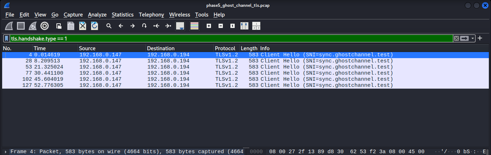
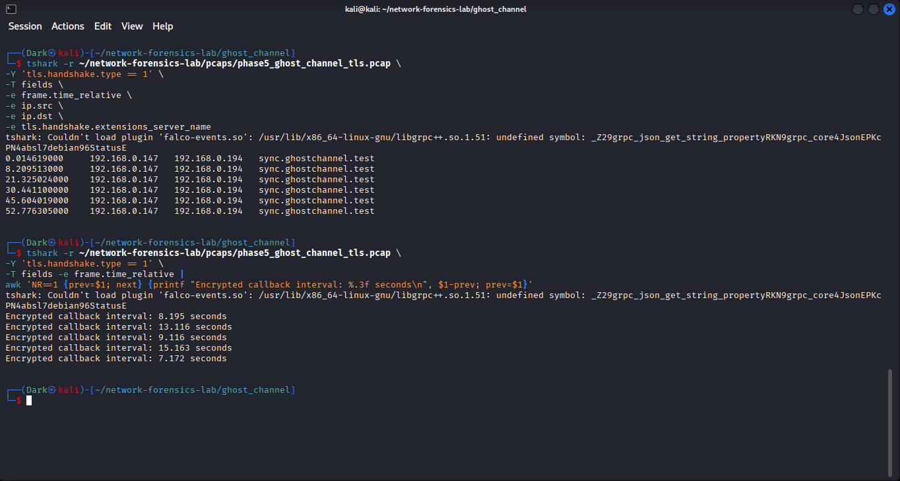
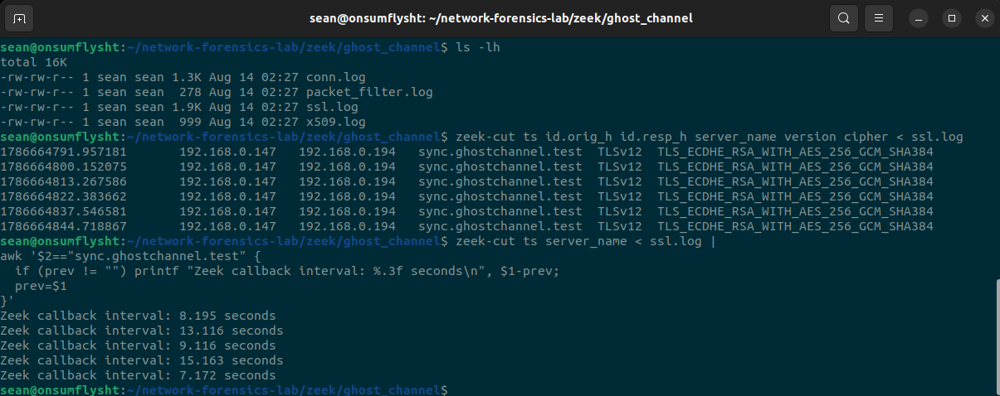
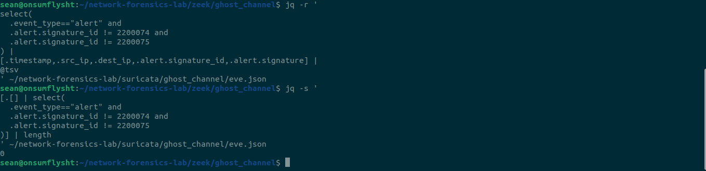

# Phase 05 — Investigation 02: GHOST CHANNEL

> **Encrypted TLS Callbacks → SNI Metadata → Timing Jitter → Zeek Correlation → Suricata Detection Gap**

---

## Investigation Overview

GHOST CHANNEL increased the difficulty of the project by moving from the obvious periodic DNS behavior used in BLACK SIGNAL to **repeated encrypted TLS sessions with deliberate timing jitter**.

The investigation asked a different question:

> **If the application payload is encrypted and the callbacks are not perfectly periodic, can the activity still be reconstructed from network metadata and timing?**

A controlled TLS endpoint was created on Kali and the physical iMac generated six separate connections to:

```text
sync.ghostchannel.test
```

on TCP port:

```text
9443
```

The connections were intentionally spaced at irregular intervals rather than a fixed schedule.

The resulting PCAP was then investigated through Wireshark, TShark, Zeek and Suricata.

The important outcome was not simply that six TLS sessions existed.

The value came from combining several weak signals:

```text
same source
+
same destination
+
same TLS SNI
+
same TLS characteristics
+
repeated short-lived sessions
+
non-random but jittered timing
```

Together, those features created a pattern that looked **automated and callback-like**, even though the encrypted application content itself was not available for direct inspection.

The active Suricata ruleset did not generate a meaningful alert for that behavioral pattern.

---

# Investigation Objective

GHOST CHANNEL was designed to test four analytical questions:

1. Could repeated encrypted sessions be identified using TLS metadata alone?
2. Could timing analysis reveal automation even when the interval was intentionally jittered?
3. Would Zeek independently reconstruct the same TLS and timing behavior?
4. Would the active Suricata ruleset generate a meaningful alert for the pattern?

This was a controlled lab exercise.

The investigation did **not** use real malware, a real command-and-control framework, credential theft or persistence.

The purpose was to practice the analytical problem defenders regularly face:

> **Encryption may hide content, but it does not necessarily hide behavior.**

---

# Investigation Environment

The investigation used the existing physical-to-virtual architecture established in earlier phases.

| Role | System | Address | Function |
|---|---|---|---|
| Physical endpoint | iMac | `192.168.0.147` | Generated repeated TLS sessions |
| TLS endpoint / capture node | Kali Linux VM | `192.168.0.194` | Hosted controlled TLS service and captured traffic |
| Network-analysis sensor | Ubuntu VM | Offline processing | Zeek and Suricata analysis |

The controlled TLS name was:

```text
sync.ghostchannel.test
```

The service used:

```text
TCP/9443
```

A self-signed certificate was used for the lab endpoint.

No external malicious infrastructure was contacted.

---

# Controlled TLS Callback Pattern

The iMac generated six separate TLS connections toward Kali using the controlled hostname.

The callback schedule intentionally introduced jitter instead of using a fixed interval.

The planned spacing was approximately:

```text
8 seconds
13 seconds
9 seconds
15 seconds
7 seconds
```

This was a direct progression from BLACK SIGNAL.

BLACK SIGNAL used near-fixed periodicity:

```text
~10s → ~10s → ~10s → ~10s
```

GHOST CHANNEL introduced variation:

```text
~8s → ~13s → ~9s → ~15s → ~7s
```

That matters because perfectly fixed timing is comparatively easy to identify.

Jitter makes a callback sequence less visually obvious and forces the analyst to reason about a **range and repeated pattern** rather than one exact interval.

---

# Evidence Preservation

The network traffic was preserved as:

```text
phase5_ghost_channel_tls.pcap
```

Approximate capture size:

```text
78 KB
```

SHA-256:

```text
6f57f39528fd23fac67f51a7f40470f43faf354c6459250bef3aa96efa7b0c2d
```

The investigation therefore worked from a fixed packet artifact that could be replayed across multiple tools.

That allowed Wireshark, TShark, Zeek and Suricata to analyze the **same evidence** rather than comparing independently generated traffic runs.

---

# Finding 01 — Repeated TLS Client Hellos

The PCAP was opened in Wireshark and filtered to TLS Client Hello messages:

```text
tls.handshake.type == 1
```

Six Client Hello packets were visible from:

```text
192.168.0.147 → 192.168.0.194
```

Each advertised the same Server Name Indication:

```text
sync.ghostchannel.test
```



The observed Client Hello timestamps were approximately:

```text
0.014619
8.209513
21.325024
30.441100
45.604019
52.776305
```

The screenshot establishes several facts at once:

```text
same source endpoint
same destination endpoint
same TLS protocol family
same SNI
six separate Client Hello events
repeated activity across ~53 seconds
```

An individual TLS Client Hello is completely ordinary.

The analytical value came from the repeated sequence.

---

# Finding 02 — Timing Jitter Quantified with TShark

TShark was used to extract the Client Hello timestamps and SNI directly from the PCAP.

The output reconstructed all six TLS initiation events for:

```text
sync.ghostchannel.test
```

The relative timestamps were then compared to calculate the delay between callbacks.

Measured intervals were:

```text
8.195 seconds
13.116 seconds
9.116 seconds
15.163 seconds
7.172 seconds
```



The timing range was therefore approximately:

```text
Minimum: 7.172 seconds
Maximum: 15.163 seconds
Range:   7.991 seconds
```

Unlike BLACK SIGNAL, there was no single fixed interval.

Instead, the activity repeatedly returned to the same TLS destination within a bounded but variable time window.

This is the key behavioral difference:

```text
Fixed periodicity
→ look for near-identical intervals

Jittered periodicity
→ look for repeated communication within a consistent range
```

The sequence still looked automated because the source repeatedly initiated connections to the same SNI over a short period, but it avoided the clean metronomic pattern seen in the previous investigation.

---

# TShark Plugin Warning

The TShark screenshot also contains a startup warning referencing:

```text
falco-events.so
libgrpc++.so.1.51
```

The warning came from an optional local TShark plugin dependency and did not prevent the PCAP from being parsed.

The important evidence is that TShark still successfully returned:

- all six Client Hello timestamps;
- the source and destination IP addresses;
- the SNI value; and
- the calculated callback intervals.

The warning was therefore treated as an unrelated local tooling issue rather than evidence of packet corruption or analysis failure.

It was intentionally not allowed to derail the investigation.

---

# Finding 03 — TLS Metadata Remained Visible

The application layer was encrypted, but useful handshake metadata remained observable.

Across the repeated sessions, analysis identified:

```text
SNI:     sync.ghostchannel.test
Version: TLSv1.2
Cipher:  TLS_ECDHE_RSA_WITH_AES_256_GCM_SHA384
```

This reinforces the baseline established in Phase 02:

```text
Encrypted payload
≠
zero network visibility
```

Even without decrypting application content, an analyst can still reason about:

- who initiated the connection;
- where it went;
- when it occurred;
- how often it repeated;
- the advertised server name;
- negotiated TLS characteristics; and
- whether multiple sessions share the same fingerprint-like properties.

GHOST CHANNEL deliberately focused on those metadata features rather than attempting TLS decryption.

---

# Zeek Correlation

The same PCAP was processed with Zeek.

Zeek produced structured TLS telemetry containing six sessions from:

```text
192.168.0.147 → 192.168.0.194
```

with:

```text
server_name = sync.ghostchannel.test
version     = TLSv12
cipher      = TLS_ECDHE_RSA_WITH_AES_256_GCM_SHA384
```

The Zeek timestamps were:

```text
1786664791.957181
1786664800.152075
1786664813.267586
1786664822.383662
1786664837.546581
1786664844.718867
```

Using those structured records, the callback intervals were calculated again:

```text
8.195 seconds
13.116 seconds
9.116 seconds
15.163 seconds
7.172 seconds
```



This was one of the strongest findings in the investigation.

TShark and Zeek independently produced the same timing pattern from different representations of the same PCAP:

```text
Raw packet fields
        ↓
TShark
        ↓
8.195 / 13.116 / 9.116 / 15.163 / 7.172

Structured TLS telemetry
        ↓
Zeek ssl.log
        ↓
8.195 / 13.116 / 9.116 / 15.163 / 7.172
```

That convergence substantially strengthens the conclusion that the observed jitter was part of the traffic itself rather than a display or calculation artifact.

---

# Why Zeek Was Valuable Here

Wireshark and TShark were ideal for proving exactly what was present in the packets.

Zeek added a different analytical advantage: it converted those packet relationships into structured network records.

Instead of repeatedly opening handshake fields, an analyst could work with columns such as:

```text
ts
id.orig_h
id.resp_h
server_name
version
cipher
```

This is much closer to how network threat hunting works at scale.

The packet capture remains the ground truth, but structured logs make correlation and repeated-pattern analysis more efficient.

---

# Suricata Detection Review

The same GHOST CHANNEL PCAP was replayed through Suricata using the active ruleset established earlier in the project.

Known checksum-related alert artifacts from offline replay were excluded from the meaningful-alert review:

```text
SID 2200074
SID 2200075
```

After those known artifacts were excluded, the meaningful alert count was:

```text
0
```



The correct interpretation is narrow:

> **The active Suricata ruleset did not generate a meaningful alert for this controlled sequence of repeated jittered TLS sessions.**

It would be incorrect to say:

```text
Suricata could not see the traffic
```

or:

```text
Suricata cannot detect encrypted command-and-control
```

The evidence supports neither claim.

What the evidence does show is that this particular behavior did not trigger a meaningful alert under the ruleset used in the lab.

---

# Detection Gap Identified

GHOST CHANNEL produced a detection-gap candidate similar to BLACK SIGNAL, but under a more difficult visibility model.

The behavior was reconstructable from network metadata:

```text
Wireshark
→ six TLS Client Hellos to one SNI

TShark
→ exact jittered timing quantified

Zeek
→ same SNI, TLS version, cipher and timing independently reproduced

Suricata
→ no meaningful alert from the active ruleset
```

The resulting detection-gap statement is:

> **A physical endpoint repeatedly initiated TLS sessions to the same SNI using consistent TLS characteristics and a bounded jittered callback pattern. The behavior was clearly reconstructable from packet and Zeek telemetry, but the active Suricata ruleset did not generate a meaningful alert for that pattern.**

Again, the issue was not lack of observable network evidence.

The issue was the absence of detection logic that correlated the repeated sessions as one behavioral sequence.

---

# BLACK SIGNAL vs GHOST CHANNEL

GHOST CHANNEL was deliberately built as a progression from the previous investigation.

| Feature | BLACK SIGNAL | GHOST CHANNEL |
|---|---|---|
| Protocol | DNS | TLS |
| Content visibility | DNS query visible | Application payload encrypted |
| Destination indicator | Domain query | TLS SNI |
| Timing | Near-fixed ~10s | Jittered 7–15s |
| Primary behavior | Periodic lookup | Repeated encrypted sessions |
| Zeek source | `dns.log` | `ssl.log` |
| Meaningful Suricata alert | 0 | 0 |

BLACK SIGNAL demonstrated that regular timing can expose automation.

GHOST CHANNEL demonstrated that the same analytical idea still works when:

- the traffic is encrypted;
- the interval is intentionally varied; and
- the analyst must rely more heavily on metadata.

---

# Behavioral Interpretation

The traffic had several properties that, in an uncontrolled environment, would justify investigation:

```text
one source host
        +
one repeated SNI
        +
multiple separate TLS sessions
        +
consistent TLS fingerprint-like metadata
        +
repeated short timing gaps
        +
intentional jitter
```

That combination can be described as:

> **encrypted callback-like behavior**

It should **not** automatically be described as:

> **confirmed command-and-control**

Many legitimate applications create repeated TLS sessions:

- software updaters;
- cloud agents;
- monitoring tools;
- messaging clients;
- telemetry services;
- API polling processes; and
- background synchronization software.

Therefore timing and metadata are useful hunting features, not standalone proof of maliciousness.

---

# Investigation Timeline

The six TLS Client Hello events can be summarized as:

| Relative Time | SNI | Interval from Previous | Observation |
|---:|---|---:|---|
| `0.015` | `sync.ghostchannel.test` | — | First TLS session |
| `8.210` | same | `8.195s` | Repeated callback |
| `21.325` | same | `13.116s` | Jitter increases |
| `30.441` | same | `9.116s` | Shorter callback delay |
| `45.604` | same | `15.163s` | Longest observed delay |
| `52.776` | same | `7.172s` | Shortest observed delay |

The sequence lasted roughly:

```text
52.762 seconds
```

from the first observed Client Hello to the last.

---

# Evidence Correlation Matrix

| Evidence Source | What It Contributed |
|---|---|
| Wireshark | Proved six repeated Client Hellos and exposed the shared SNI |
| TShark | Extracted timestamps, endpoints and SNI; quantified callback jitter |
| Zeek `ssl.log` | Independently reproduced SNI, TLS version, cipher and timing |
| Suricata `eve.json` alert review | Showed zero meaningful alerts after checksum artifacts were excluded |
| SHA-256 | Provided an integrity reference for the preserved PCAP |

The strongest conclusion came from correlation rather than any one screenshot.

---

# What the Evidence Proved

GHOST CHANNEL evidence supports the following conclusions:

- The physical endpoint at `192.168.0.147` initiated six TLS sessions toward `192.168.0.194`.
- The sessions advertised the SNI `sync.ghostchannel.test`.
- The observed TLS version was TLS 1.2.
- The sessions used `TLS_ECDHE_RSA_WITH_AES_256_GCM_SHA384` in the Zeek telemetry.
- Six Client Hello timestamps were visible in the preserved capture.
- The measured inter-session intervals were `8.195`, `13.116`, `9.116`, `15.163`, and `7.172` seconds.
- The intervals were intentionally jittered rather than fixed.
- Zeek independently reproduced the same SNI, TLS characteristics and timing sequence.
- The active Suricata ruleset produced zero meaningful alerts after the known checksum SIDs were excluded.
- The behavior remained analytically visible despite encrypted application data.
- The PCAP was preserved as `phase5_ghost_channel_tls.pcap` with SHA-256 `6f57f39528fd23fac67f51a7f40470f43faf354c6459250bef3aa96efa7b0c2d`.

---

# What the Evidence Did NOT Prove

The evidence does **not** prove:

- that malware was present;
- that the iMac was compromised;
- that `sync.ghostchannel.test` represented real malicious infrastructure;
- that the encrypted payload contained commands or stolen data;
- that successful command-and-control occurred;
- that the repeated TLS sessions were malicious by themselves;
- that Suricata generally cannot detect TLS-based threats;
- that encryption made the connection invisible; or
- that jitter is unique to malicious traffic.

The most defensible conclusion is behavioral:

> **The PCAP contained controlled, repeated TLS sessions with consistent destination metadata and intentional timing jitter that resembled automated callback behavior. The activity was visible in packet and Zeek telemetry, but the active IDS rules did not produce a meaningful alert for the sequence.**

---

# Detection Engineering Takeaway

GHOST CHANNEL illustrates why encrypted network detection often depends on metadata and correlation rather than payload signatures.

A single-packet rule might ask:

```text
Does this TLS packet contain a known bad indicator?
```

But the interesting behavior here existed across multiple sessions:

```text
same source
+
same SNI
+
same TLS characteristics
+
multiple new connections
+
bounded repeated timing
```

A conceptual behavioral detection might therefore evaluate a rolling time window:

```text
IF
    one endpoint repeatedly opens TLS sessions to the same uncommon SNI
AND
    the connections occur several times within a short period
AND
    the timing falls inside a recurring jitter range
THEN
    raise an encrypted callback-like behavior alert
```

Such a rule would require careful tuning.

Legitimate software frequently performs repeated TLS communication, so useful detection logic would likely need additional context such as:

- domain reputation or rarity;
- process telemetry;
- endpoint prevalence;
- connection duration;
- byte patterns;
- time-of-day behavior;
- certificate characteristics; or
- follow-on activity.

The point of GHOST CHANNEL was not to claim that timing alone solves encrypted C2 detection.

It was to demonstrate how timing can become **one useful feature in a layered behavioral detection model**.

---

# Skills Demonstrated

This investigation exercised:

- TLS packet analysis
- TLS Client Hello identification
- Server Name Indication analysis
- Encrypted-traffic metadata analysis
- Wireshark filtering
- TShark field extraction
- Inter-session timing analysis
- Jitter analysis
- Behavioral network hunting
- Zeek `ssl.log` analysis
- TLS version and cipher interpretation
- Cross-tool evidence correlation
- Suricata offline PCAP replay
- IDS alert validation
- Known checksum-artifact filtering
- Detection-gap analysis
- PCAP preservation
- SHA-256 integrity tracking
- Evidence-backed conclusion writing
- Distinguishing callback-like behavior from confirmed C2

---

# Analyst Study Notes

### Encryption changes the evidence — it does not erase it

With plaintext HTTP, an analyst may see methods, URIs, headers and content.

With TLS, much of the application data is hidden.

But useful features can remain:

```text
IP addresses
ports
timestamps
session frequency
SNI
TLS version
cipher suite
certificate metadata
connection size and duration
```

That metadata can still support threat hunting.

---

### Jitter does not mean randomness

The intervals were deliberately varied:

```text
8.195
13.116
9.116
15.163
7.172
```

They were not equal, but they still formed repeated communication inside a limited time range.

The hunting question changes from:

```text
"Does this happen every exactly 10 seconds?"
```

to:

```text
"Does this endpoint repeatedly return to the same destination within a recurring bounded interval?"
```

---

### SNI can become an investigation pivot

Even when the application payload is encrypted, the observed TLS handshake exposed:

```text
sync.ghostchannel.test
```

That gives the analyst a stable value around which multiple sessions can be grouped and compared.

---

### Correlation is stronger than one indicator

None of these alone proves maliciousness:

```text
TLS traffic
repeated sessions
one SNI
jittered timing
```

Together they create a stronger behavioral hypothesis.

This is why investigations should combine weak signals instead of relying on one dramatic indicator.

---

### No alert does not equal no evidence

GHOST CHANNEL again produced:

```text
behavior observable
+
telemetry available
+
meaningful IDS alerts = 0
```

That is exactly the type of situation where detection-gap analysis becomes useful.

---

# Interview Talking Point

A concise way to explain GHOST CHANNEL in an interview:

> I wanted to make the timing analysis harder than a fixed DNS beacon, so I generated six controlled TLS sessions from a physical endpoint to the same lab SNI with intentional jitter. In Wireshark I identified the six Client Hellos, then used TShark to measure intervals of roughly 7 to 15 seconds. I processed the same PCAP with Zeek and independently reproduced the SNI, TLS 1.2 cipher metadata and the exact same timing intervals from `ssl.log`. I then replayed the capture through Suricata; after excluding known checksum artifacts from the offline capture, there were no meaningful alerts. The conclusion was not that the traffic was proven C2, but that encrypted callback-like behavior was visible in metadata while the active IDS rules did not correlate it into a detection.

---

# Investigation Result

**Investigation 02 — GHOST CHANNEL: COMPLETE**

```text
Controlled TLS callbacks generated       ✅
Six Client Hellos identified             ✅
Shared SNI confirmed                     ✅
TLS metadata analyzed                    ✅
Jittered timing measured                 ✅
7–15 second interval range observed      ✅
Zeek TLS correlation completed           ✅
Zeek timing independently validated      ✅
Suricata alert review completed          ✅
Meaningful IDS alerts: 0                 ✅
Detection-gap candidate documented       ✅
C2 overclaim avoided                     ✅
```

GHOST CHANNEL extended the project's behavioral-analysis model from simple periodic DNS into encrypted traffic:

```text
Encrypted traffic
        ↓
Handshake metadata
        ↓
Repeated destination
        ↓
Timing jitter
        ↓
Cross-tool correlation
        ↓
Detection validation
```

The next phase, NIGHTFALL, would combine several different suspicious behaviors into a **blind PCAP investigation**, requiring the analyst to reconstruct the event sequence before consulting Zeek or Suricata and then use the resulting evidence to validate and improve detection coverage.
