# Phase 06 — Investigation 03: NIGHTFALL

> **Blind PCAP Investigation → Manual Reconstruction → Zeek Correlation → Suricata Detection-Gap Analysis → Custom Detection → Replay Validation**

---

## Investigation Overview

**NIGHTFALL** was designed as the blind investigation phase of the Network Detection and Packet Forensics Home Lab.

Unlike the earlier investigations, I was not given the expected attack sequence, packet indicators, requested resources, or final answer before beginning the investigation. The activity was generated in a controlled lab environment and captured into a PCAP, but I deliberately avoided reviewing the case-generation command, Kali HTTP server logs, Zeek telemetry, or Suricata output before completing my initial packet-level investigation.

The objective was to approach the capture as an analyst would approach an unfamiliar network case:

> **Determine what happened, identify the initiating host, reconstruct the sequence of activity, distinguish successful actions from failed attempts, and support every conclusion with network evidence.**

The investigation ultimately revealed a multi-stage sequence containing TCP reconnaissance, successful HTTP file retrievals, a harmless EICAR antivirus-test artifact transfer, an attempted path traversal, and repeated HTTP check-in behavior.

The same PCAP was then processed through Zeek and Suricata to compare manual packet analysis with structured network telemetry and IDS detection coverage.

The final stage identified a genuine **detection-coverage gap relative to the lab objective**, created a custom Suricata rule, and replayed the exact same PCAP to validate that the gap had been closed.

---

# Case Environment

| Role | System | Address / Function |
|---|---|---|
| Endpoint under investigation | Physical iMac | `192.168.0.147` |
| Lab service / destination | Kali Linux VM | `192.168.0.194` |
| Packet-analysis workstation | Kali Linux | Wireshark, TShark, tcpdump |
| Network telemetry / IDS sensor | Ubuntu VM | Zeek 7.0.11, Suricata 8.0.6 |
| Evidence-transfer bridge | MacBook host | Temporary PCAP transfer between VMs |

The systems were intentionally used in different roles rather than running every VM simultaneously.

Kali handled packet capture and manual analysis, while Ubuntu later processed the exact same evidence through Zeek and Suricata.

---

# Blind Investigation Rules

To preserve the integrity of the investigation, several restrictions were followed before manual analysis was complete:

- The encoded case-generation command was not decoded.
- Kali HTTP server logs were not reviewed.
- Zeek was not run against the PCAP.
- Suricata was not run against the PCAP.
- No expected attack sequence was provided.
- Conclusions had to be derived from the captured traffic first.

Only after a manual hypothesis was established were Zeek and Suricata introduced.

This separation was important because the goal was not simply to confirm known activity. The goal was to determine whether the network evidence itself was sufficient to reconstruct what happened.

---

# Evidence Preservation

The NIGHTFALL traffic was captured into:

```text
phase6_nightfall_blind_case.pcap
```

File size:

```text
12K
```

SHA-256:

```text
493139937f20b19706671896e46bf5e86a15b61a41d3527a2daf2835731955cb
```

The PCAP was hashed immediately after capture.

Before processing the evidence on Ubuntu, the file was transferred:

```text
Kali → MacBook → Ubuntu
```

The SHA-256 value was recalculated after each transfer and remained identical.

This confirmed that the same byte-for-byte evidence captured on Kali was later processed by Zeek and Suricata.

---

# Investigation Question

The core question for NIGHTFALL was:

> **What network activity occurred between `192.168.0.147` and `192.168.0.194`, and what can be proven from the packet evidence alone?**

The initial investigation began with no display filter and focused on identifying unusual conversations, destination ports, successful connections, and follow-on activity.

---

# Finding 01 — TCP Reconnaissance

Wireshark's **Statistics → Conversations → TCP** view immediately showed something unusual.

The endpoint:

```text
192.168.0.147
```

attempted connections to multiple TCP services on:

```text
192.168.0.194
```

Observed destination ports included:

```text
22
80
443
8080
8443
9443
9999
```

Most conversations contained only approximately two packets and 132 bytes, suggesting short connection attempts rather than completed application sessions.

Port `8080`, however, behaved differently.

Several later conversations involving TCP/8080 contained more packets and substantially more transferred data.

This produced the first working hypothesis:

> `192.168.0.147` appeared to be probing multiple TCP ports on `192.168.0.194`, followed by additional activity against TCP/8080.

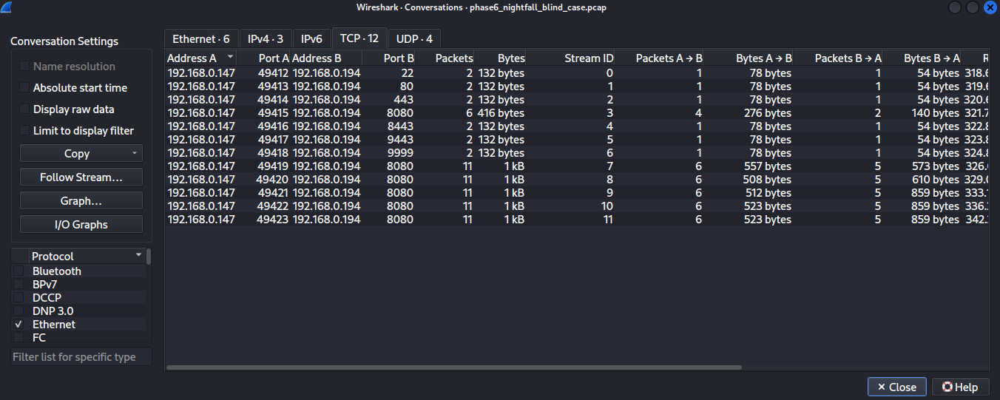

---

# Finding 02 — Port 8080 Was the Accessible Service

To validate the reconnaissance hypothesis, SYN and SYN/ACK traffic was examined separately.

Initial connection attempts were isolated using:

```text
tcp.flags.syn == 1 && tcp.flags.ack == 0
```

The sequence showed connection attempts against:

```text
22 → 80 → 443 → 8080 → 8443 → 9443 → 9999
```

The attempts occurred close together in time, consistent with a small sequential service probe.

Successful SYN/ACK responses were then isolated using:

```text
tcp.flags.syn == 1 && tcp.flags.ack == 1
```

The successful responses originated from:

```text
192.168.0.194:8080
```

Rejected attempts were identified with:

```text
tcp.flags.reset == 1
```

RST/ACK responses were observed for:

```text
22
80
443
8443
9443
9999
```

Port `8080` did not appear among those rejected services.

The evidence therefore supported the conclusion:

> **The endpoint performed TCP reconnaissance, discovered TCP/8080 as an available service, and then initiated follow-on application activity against that service.**

This was the first major NIGHTFALL timeline event.

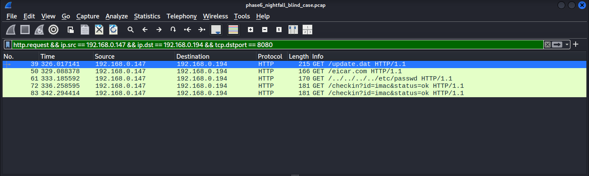

---

# Finding 03 — Successful Retrieval of `update.dat`

HTTP activity was isolated after identifying TCP/8080 as the active service.

One request stood out:

```http
GET /update.dat HTTP/1.1
Host: 192.168.0.194:8080
```

The request used a custom User-Agent:

```text
Mozilla/5.0 (Macintosh; Intel Mac OS X 10_13_6) NightfallUpdater/2.4
```

The presence of a custom `NightfallUpdater/2.4` identifier suggested that the request originated from scripted or purpose-built activity rather than ordinary browser navigation.

The corresponding HTTP response showed:

```text
HTTP/1.0 200 OK
Content-Type: application/octet-stream
Content-Length: 34
File Data: 34 bytes
```

This established that `/update.dat` was successfully transferred to the endpoint.

The evidence supported:

> **After identifying TCP/8080, the endpoint used a custom update-style client to retrieve a 34-byte file from the HTTP service.**

Importantly, packet evidence alone did not justify calling `update.dat` malicious.

The correct conclusion was only that a scripted-looking client successfully retrieved the artifact.

---

# Finding 04 — EICAR Test Artifact Transfer

The next HTTP request was more significant:

```http
GET /eicar.com HTTP/1.1
```

It used another custom User-Agent:

```text
NightfallFetcher/1.0
```

The corresponding server response showed:

```text
HTTP/1.0 200 OK
Content-Type: application/x-msdos-program
Content-Length: 68
File Data: 68 bytes
```

This confirmed that the requested artifact was successfully transferred from:

```text
192.168.0.194:8080
```

to:

```text
192.168.0.147
```

The transferred file was the **EICAR antivirus test file**.

EICAR is not malware. It is a standardized harmless test artifact intentionally designed to trigger antivirus and security detection systems.

The use of EICAR allowed the lab to generate security-alert-worthy network content without executing or distributing genuine malware.

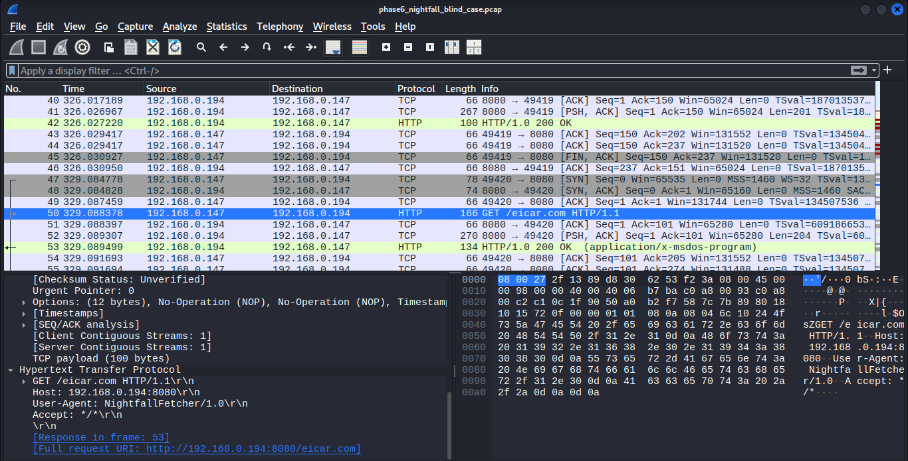

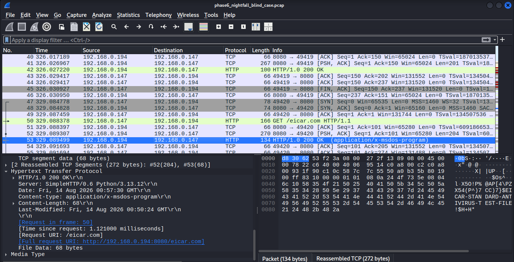

The evidence supported:

> **A 68-byte EICAR test artifact was successfully transferred over HTTP following the earlier reconnaissance and update-file retrieval.**

This became one of the most important artifacts later in the detection-engineering portion of the case.

---

# Finding 05 — Attempted Path Traversal

A later HTTP request contained a highly suspicious URI:

```http
GET /../../../../etc/passwd HTTP/1.1
```

The request used:

```text
User-Agent: curl/7.54.0
```

The traversal sequence:

```text
../../../../
```

appeared intended to move outside the expected web directory and request the Unix system file:

```text
/etc/passwd
```

This behavior was classified as a **path traversal attempt**.

However, the response had to be inspected before determining whether the attempt succeeded.

The server returned:

```text
HTTP/1.0 404 File not found
Content-Type: text/html; charset=utf-8
Content-Length: 335
```

No `/etc/passwd` contents were returned.

The 335 bytes visible in the response represented the HTTP 404 page, not the requested system file.

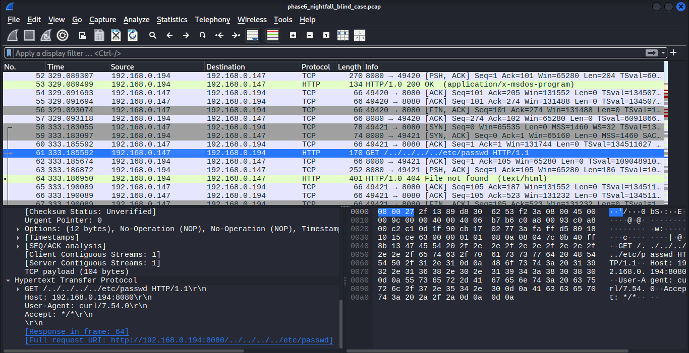

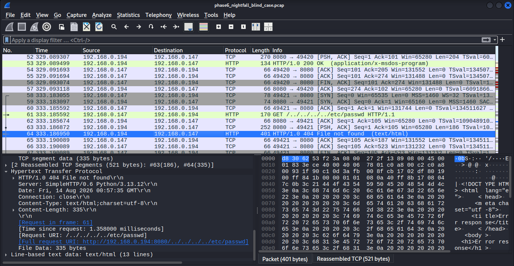

The evidence supported:

> **The endpoint attempted path traversal against the HTTP service to retrieve `/etc/passwd`, but the attempt failed with HTTP 404 and no system-file contents were obtained.**

This distinction was important.

The request itself was suspicious, but packet evidence did **not** support claiming a successful file disclosure.

---

# Finding 06 — Repeated HTTP Check-ins

Following the file retrievals and traversal attempt, additional HTTP activity appeared:

```http
GET /checkin?id=imac&status=ok HTTP/1.1
```

The requests used another custom User-Agent:

```text
Nightfall-Agent/1.0
```

Two captured requests occurred at approximately:

```text
336.259 seconds
342.294 seconds
```

This represented an interval of approximately:

```text
6.036 seconds
```

Both requests targeted the same server and used the same URI structure and User-Agent.

The server returned HTTP 404 responses.

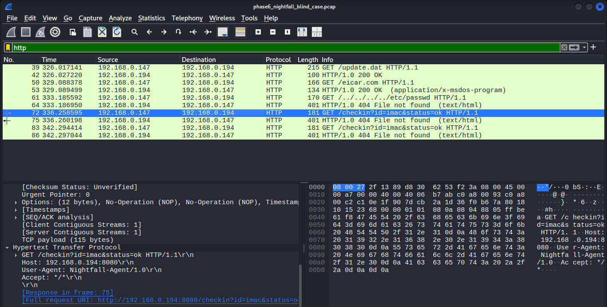

The evidence supported:

> **The endpoint performed repeated automated HTTP check-in attempts using `Nightfall-Agent/1.0`, approximately six seconds apart.**

The behavior was considered **callback/beacon-like**, but successful command-and-control communication could not be proven because the requests received HTTP 404 responses.

This was intentionally kept separate from the stronger claim of actual C2.

---

# Manual HTTP Timeline

TShark was used to convert the packet-level HTTP requests into a concise chronological timeline.

The request sequence was extracted from the PCAP using selected HTTP fields.

The resulting activity showed:

```text
/update.dat
/eicar.com
/../../../../etc/passwd
/checkin?id=imac&status=ok
/checkin?id=imac&status=ok
```

alongside the corresponding custom User-Agent values.

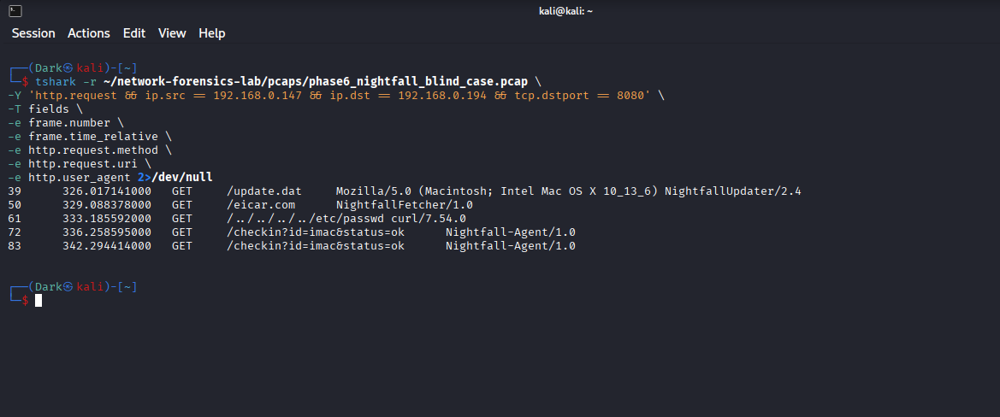

This helped consolidate the post-recon sequence into a single evidence view.

---

# Manual Analyst Hypothesis

Before introducing Zeek or Suricata, the following evidence-backed hypothesis was established:

> **`192.168.0.147` performed TCP reconnaissance against `192.168.0.194` and discovered TCP/8080 as an available service. The endpoint then successfully retrieved `update.dat` and a harmless EICAR test artifact. A later path traversal attempt targeted `/etc/passwd`, but failed with HTTP 404 and no system-file contents were returned. The endpoint subsequently made repeated automated HTTP check-in requests using `Nightfall-Agent/1.0`, approximately six seconds apart. These requests were consistent with callback/beacon-like behavior, although successful C2 communication could not be established.**

This hypothesis was deliberately recorded **before Zeek or Suricata analysis**.

---

# Zeek Correlation

After completing manual analysis, the same preserved PCAP was processed using Zeek.

The goal was to determine whether Zeek's structured telemetry independently supported the manual findings.

The HTTP log was queried using:

```bash
zeek-cut ts id.orig_h id.resp_h method uri status_code user_agent < http.log
```

Zeek reconstructed:

```text
GET /update.dat                  200  NightfallUpdater/2.4
GET /eicar.com                   200  NightfallFetcher/1.0
GET /../../../../etc/passwd      404  curl/7.54.0
GET /checkin?id=imac&status=ok   404  Nightfall-Agent/1.0
GET /checkin?id=imac&status=ok   404  Nightfall-Agent/1.0
```

The Zeek `conn.log` also reconstructed the reconnaissance phase.

Connection states included:

```text
22    REJ
80    REJ
443   REJ
8080  SF
8443  REJ
9443  REJ
9999  REJ
```

In this context:

```text
REJ = connection attempt rejected
SF  = connection established and closed normally
```

The connection telemetry therefore independently confirmed that TCP/8080 behaved differently from the other probed ports.

Additional successful HTTP sessions to TCP/8080 then appeared in `conn.log`.

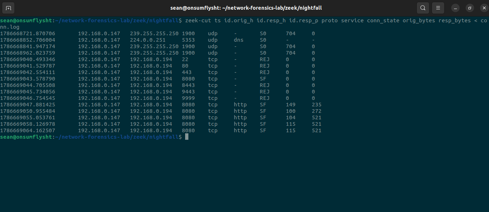

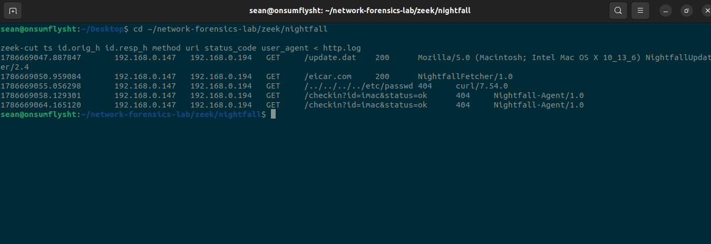

This produced an important result:

> **The manually reconstructed timeline was independently supported by Zeek's structured HTTP and connection telemetry.**

The case therefore demonstrated two evidence layers reaching the same conclusion:

```text
Raw packets / Wireshark / TShark
                 ↓
            same finding
                 ↓
      Zeek structured telemetry
```

---

# Suricata Initial Analysis

The NIGHTFALL PCAP was then processed with Suricata 8.0.6.

Because the lab capture environment produced checksum-offloading artifacts, offline replay used:

```text
-k none
```

Known Suricata checksum alerts such as:

```text
2200074 — SURICATA TCPv4 invalid checksum
```

were treated as capture artifacts rather than security detections.

After excluding the known checksum noise, the stock Suricata ruleset produced:

```text
0 meaningful NIGHTFALL alerts
```

This was initially surprising because the PCAP contained the EICAR test transfer and the suspicious path traversal attempt.

Rather than immediately labeling this a detection gap, the next step was to determine whether Suricata had actually parsed the traffic.

---

# Suricata File Telemetry

Suricata's EVE JSON `fileinfo` records showed that the HTTP transactions were successfully reconstructed.

Observed file-related telemetry included:

```text
/update.dat   34 bytes   CLOSED
/eicar.com    68 bytes   CLOSED
/etc/passwd   335 bytes  CLOSED
/checkin      335 bytes  CLOSED
/checkin      335 bytes  CLOSED
```

The `/etc/passwd` and `/checkin` sizes represented the HTTP 404 response pages, not successful retrieval of those resources.

The EICAR file record was inspected in detail.

Suricata reported:

```text
filename: /eicar.com
http status: 200
size: 68
state: CLOSED
gaps: false
stored: false
```

The corresponding HTTP metadata also contained:

```text
NightfallFetcher/1.0
```

This was an important distinction.

Suricata had clearly observed and reconstructed the EICAR transaction.

Therefore:

> **This was not a telemetry visibility gap.**

The engine had the relevant network evidence.

---

# Detection Coverage Analysis

The active Suricata ruleset was searched for EICAR-specific coverage.

The rules were checked for:

```text
EICAR
X5O!P%@AP
ANTIVIRUS-TEST-FILE
```

The result was:

```text
No EICAR detection signature found
```

This established that the lack of an EICAR alert was not because Suricata failed to parse the transfer.

Instead:

```text
Traffic visible?          YES
HTTP parsed?              YES
File reconstructed?       YES
EICAR transfer observed?  YES
Relevant stock rule?      NO
Meaningful alert?         NO
```

The finding was therefore classified as a **detection coverage gap relative to the lab's detection objective**.

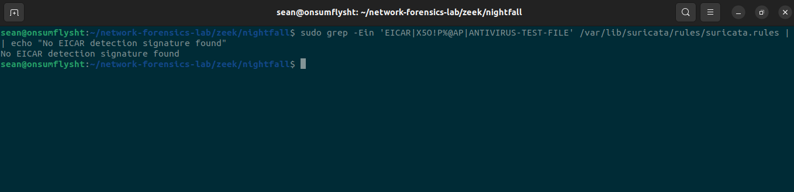

This distinction became one of the central lessons of the project:

> **Visibility does not automatically equal detection.**

A sensor can observe an event perfectly while the detection layer still lacks logic to alert on it.

---

# Custom Suricata Detection

To close the identified gap, a custom Suricata rule was created.

The rule was stored as:

```text
rules/nightfall.rules
```

Custom SID:

```text
1000001
```

Rule:

```suricata
alert http any any -> any any (msg:"NIGHTFALL EICAR Test Artifact Transfer"; flow:established,to_client; file.data; content:"EICAR-STANDARD-ANTIVIRUS-TEST-FILE"; sid:1000001; rev:1;)
```

The rule uses:

```text
file.data
```

to inspect the HTTP response body.

Rather than alerting merely because the filename contained `eicar.com`, the detection searches the transferred HTTP content for:

```text
EICAR-STANDARD-ANTIVIRUS-TEST-FILE
```

This provides stronger evidence that the actual test artifact content was transferred.

---

# Rule Validation

Before replaying the PCAP, the custom rule was validated using Suricata test mode:

```bash
sudo suricata -T \
-c /etc/suricata/suricata.yaml \
-S ~/network-forensics-lab/suricata/custom/nightfall.rules
```

Suricata returned:

```text
Configuration provided was successfully loaded. Exiting.
```

This confirmed that the custom rule syntax and configuration were valid before testing detection behavior.

---

# Same-PCAP Replay Validation

The exact same NIGHTFALL PCAP was then replayed through Suricata again.

This time Suricata loaded only the custom detection rule.

The resulting alert was:

```text
192.168.0.194:8080
        →
192.168.0.147:49420

SID 1000001
NIGHTFALL EICAR Test Artifact Transfer
```

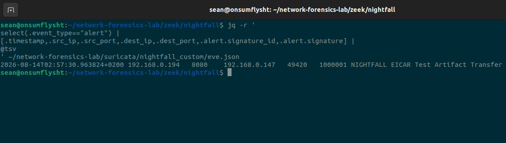

The traffic direction was consistent with the HTTP server sending the requested EICAR test artifact back to the endpoint.

This completed the validation chain:

```text
Original NIGHTFALL PCAP
        ↓
Stock Suricata rules
        ↓
0 meaningful alerts
        ↓
File telemetry confirms full EICAR transfer
        ↓
Ruleset analysis identifies missing coverage
        ↓
Custom SID 1000001 written
        ↓
Rule syntax validated
        ↓
Exact same NIGHTFALL PCAP replayed
        ↓
CUSTOM ALERT FIRES
```

---

# Before vs After Detection

A final comparison was performed using the original stock-rules output and the custom-rule replay output.

The result was:

```text
=== BEFORE: STOCK RULESET ===
0

=== AFTER: CUSTOM DETECTION ===
1000001    NIGHTFALL EICAR Test Artifact Transfer
```


This is the strongest detection-engineering result from the NIGHTFALL case.

The network evidence remained identical.

The only meaningful variable changed was the detection logic.

Therefore:

> **The custom detection demonstrably closed the identified coverage gap.**

---

# Final NIGHTFALL Timeline

The final reconstructed case timeline was:

```text
1. 192.168.0.147 begins sequential TCP reconnaissance.

2. Ports 22, 80, 443, 8443, 9443 and 9999 reject the
   connection attempts.

3. TCP/8080 responds successfully.

4. The endpoint shifts follow-on activity to TCP/8080.

5. NightfallUpdater/2.4 requests /update.dat.

6. The server returns HTTP 200 and transfers the 34-byte file.

7. NightfallFetcher/1.0 requests /eicar.com.

8. The server returns HTTP 200 and transfers the 68-byte EICAR
   antivirus-test artifact.

9. curl/7.54.0 attempts a path traversal request for
   /../../../../etc/passwd.

10. The server returns HTTP 404.
    No passwd contents are retrieved.

11. Nightfall-Agent/1.0 begins repeated HTTP check-ins:

    /checkin?id=imac&status=ok

12. The observed check-ins occur approximately six seconds apart.

13. Both captured check-ins return HTTP 404.

14. Zeek independently reconstructs the reconnaissance and HTTP
    activity.

15. Suricata reconstructs the HTTP/file telemetry but produces
    zero meaningful stock-rule alerts.

16. Ruleset analysis confirms no EICAR detection signature exists
    in the active ruleset.

17. Custom Suricata SID 1000001 is created.

18. The exact same NIGHTFALL PCAP is replayed.

19. The custom NIGHTFALL EICAR detection fires successfully.
```

---

# Final Analyst Conclusion

The NIGHTFALL PCAP showed a controlled multi-stage sequence originating from:

```text
192.168.0.147
```

and targeting:

```text
192.168.0.194
```

The activity began with TCP reconnaissance across multiple common and non-standard service ports.

TCP/8080 was identified as the accessible service and became the focus of follow-on HTTP activity.

The endpoint successfully retrieved two files:

```text
/update.dat
/eicar.com
```

The second file was the harmless 68-byte EICAR antivirus test artifact.

The endpoint later attempted HTTP path traversal toward:

```text
/etc/passwd
```

but the attempt failed with HTTP 404 and no system-file contents were returned.

Repeated automated requests to:

```text
/checkin?id=imac&status=ok
```

were then observed using:

```text
Nightfall-Agent/1.0
```

approximately six seconds apart.

These requests were consistent with callback/beacon-like behavior, although successful command-and-control communication could not be proven because the server returned HTTP 404.

Manual Wireshark and TShark analysis reconstructed the sequence before any higher-level telemetry was consulted.

Zeek independently confirmed both the reconnaissance and HTTP timeline.

Suricata successfully parsed the underlying HTTP transactions and reconstructed the EICAR transfer, demonstrating that the event was visible to the sensor.

However, the active stock ruleset lacked an EICAR-specific detection signature, resulting in zero meaningful alerts.

A custom Suricata rule using SID `1000001` was written to inspect HTTP response file data for the EICAR test content.

After validating the rule, the identical NIGHTFALL PCAP was replayed.

The custom rule successfully generated:

```text
NIGHTFALL EICAR Test Artifact Transfer
```

The case therefore demonstrated the complete workflow:

```text
packet evidence
→ manual investigation
→ hypothesis
→ telemetry correlation
→ detection-gap analysis
→ custom detection engineering
→ same-evidence replay
→ validation
```

---

# What the Evidence Proved

The evidence supported the following conclusions:

- `192.168.0.147` performed sequential TCP reconnaissance.
- TCP/8080 was accessible while the other tested ports were rejected.
- `update.dat` was successfully retrieved.
- `eicar.com` was successfully retrieved.
- The EICAR transfer contained 68 bytes.
- A path traversal request targeted `/etc/passwd`.
- The traversal attempt failed with HTTP 404.
- No `/etc/passwd` contents were retrieved.
- Repeated automated HTTP check-ins occurred.
- The captured check-ins were approximately six seconds apart.
- Zeek independently confirmed the packet-level findings.
- Suricata successfully parsed the relevant HTTP/file telemetry.
- The active stock ruleset contained no matching EICAR signature.
- No meaningful stock Suricata alert identified the EICAR transfer.
- Custom SID `1000001` successfully detected the transfer after replay.

---

# What the Evidence Did NOT Prove

The investigation deliberately avoided overstating the evidence.

The PCAP did **not** prove:

- that `update.dat` was malicious;
- that genuine malware executed;
- that credentials were stolen;
- that `/etc/passwd` was successfully accessed;
- that persistence was established;
- that the repeated `/checkin` requests represented functioning C2;
- that the endpoint was genuinely compromised.

NIGHTFALL was a controlled adversary-simulation case.

The strength of the investigation comes from separating:

```text
what the packets showed
```

from:

```text
what an analyst might infer
```

and from avoiding conclusions that the evidence could not support.

---

# Detection Engineering Result

The key detection-engineering result was:

```text
BEFORE
Same NIGHTFALL PCAP
→ complete Suricata telemetry
→ 0 meaningful stock alerts

AFTER
Same NIGHTFALL PCAP
→ custom SID 1000001
→ NIGHTFALL EICAR Test Artifact Transfer
```

This demonstrates why detection engineering is more than simply enabling an IDS.

A sensor can possess complete visibility into an event and still fail to produce a useful detection if the relevant rule logic does not exist.

---

# Behavioral Mapping

The controlled NIGHTFALL activity was designed to resemble several behaviors commonly investigated in blue-team environments.

| Observed behavior | Lab interpretation |
|---|---|
| Sequential probes across multiple TCP services | Network service reconnaissance |
| Successful HTTP artifact retrieval | Simulated tool/file transfer |
| EICAR transfer | Safe test artifact intended to exercise detection |
| `../../../../etc/passwd` request | Attempted path traversal |
| Repeated `/checkin` requests | Callback/beacon-like behavior |
| Custom User-Agents | Scripted / automated client activity |
| Same-PCAP replay after rule change | Detection validation |

The lab intentionally uses cautious language such as **resembles**, **simulated**, and **beacon-like** where the network evidence does not justify stronger attribution.

---

# Skills Demonstrated

NIGHTFALL exercised the following skills:

- Blind PCAP investigation
- Wireshark packet analysis
- TCP conversation analysis
- SYN / SYN-ACK / RST interpretation
- HTTP request and response reconstruction
- User-Agent analysis
- File-transfer reconstruction
- Path-traversal investigation
- Beacon/callback pattern recognition
- TShark timeline extraction
- Zeek `conn.log` analysis
- Zeek `http.log` analysis
- Suricata EVE JSON analysis
- Suricata `fileinfo` analysis
- IDS alert triage
- Detection-gap analysis
- Rule-coverage validation
- Custom Suricata signature development
- Suricata rule testing
- PCAP replay
- Detection validation
- SHA-256 evidence integrity verification
- Evidence-backed analyst reporting

---

# Analyst Study Notes

### Visibility is not detection

A sensor seeing traffic does not mean an alert will exist.

In NIGHTFALL, Suricata successfully reconstructed the EICAR transfer but generated no meaningful alert because the active detection logic did not cover the event.

```text
Telemetry present ≠ Detection present
```

---

### SYN, SYN/ACK and RST can reveal reconnaissance

A simple service-probe sequence can often be reconstructed using TCP flags.

```text
SYN
```

indicates a connection attempt.

```text
SYN, ACK
```

shows that a service accepted the connection.

```text
RST, ACK
```

can indicate the target port rejected the connection.

This allowed the investigation to identify TCP/8080 as the accessible service without relying on application logs.

---

### HTTP status codes matter

A suspicious request is not automatically a successful attack.

For example:

```text
GET /../../../../etc/passwd
```

was clearly suspicious.

But the server returned:

```text
404 File not found
```

Therefore the correct finding was:

```text
attempted path traversal
```

not:

```text
successful /etc/passwd disclosure
```

---

### Custom User-Agents can reveal automation

Observed examples included:

```text
NightfallUpdater/2.4
NightfallFetcher/1.0
Nightfall-Agent/1.0
curl/7.54.0
```

User-Agent differences helped distinguish different stages of the scripted activity.

---

### Fileinfo is telemetry, not automatically an alert

Suricata's `fileinfo` output can show that a file transfer occurred even when no IDS signature fires.

For NIGHTFALL:

```text
/eicar.com
size: 68
state: CLOSED
gaps: false
```

proved that Suricata observed the complete transfer.

The absence of a corresponding alert therefore pointed toward detection coverage rather than missing traffic visibility.

---

### Replay validation is stronger than simply writing a rule

A rule is not proven useful just because its syntax loads.

The stronger workflow is:

```text
capture evidence
→ identify gap
→ create rule
→ validate syntax
→ replay same PCAP
→ confirm expected alert
```

NIGHTFALL followed this workflow using the exact same preserved PCAP before and after the detection change.

---

# Interview Talking Point

A concise way to explain NIGHTFALL in an interview:

> I created a blind network investigation where I analyzed an unknown PCAP manually before looking at any SIEM-style telemetry. I reconstructed TCP reconnaissance, identified port 8080 as the accessible service, traced two successful file transfers including a harmless EICAR test artifact, confirmed a failed path-traversal attempt, and identified repeated automated check-ins. I then validated my findings with Zeek. Suricata had complete file telemetry for the EICAR transfer but generated no meaningful alert because the active ruleset lacked coverage. I wrote and validated a custom Suricata rule, replayed the exact same hashed PCAP, and confirmed the new detection fired successfully.

---

# Phase 06 Result

**Investigation 03 — NIGHTFALL: COMPLETE**

```text
Blind investigation          ✅
TCP recon reconstructed       ✅
Open service identified       ✅
HTTP timeline reconstructed   ✅
EICAR transfer confirmed      ✅
Failed traversal confirmed    ✅
Repeated check-ins identified ✅
Zeek correlation completed    ✅
Suricata telemetry confirmed  ✅
Detection gap identified      ✅
Custom rule developed         ✅
Same-PCAP replay performed    ✅
Detection validated           ✅
```

NIGHTFALL became the strongest example in the project of moving from raw packet evidence to a defensible analyst conclusion and then turning that investigation into improved detection coverage.