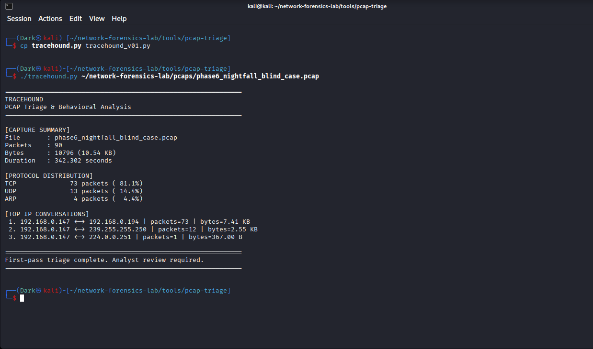
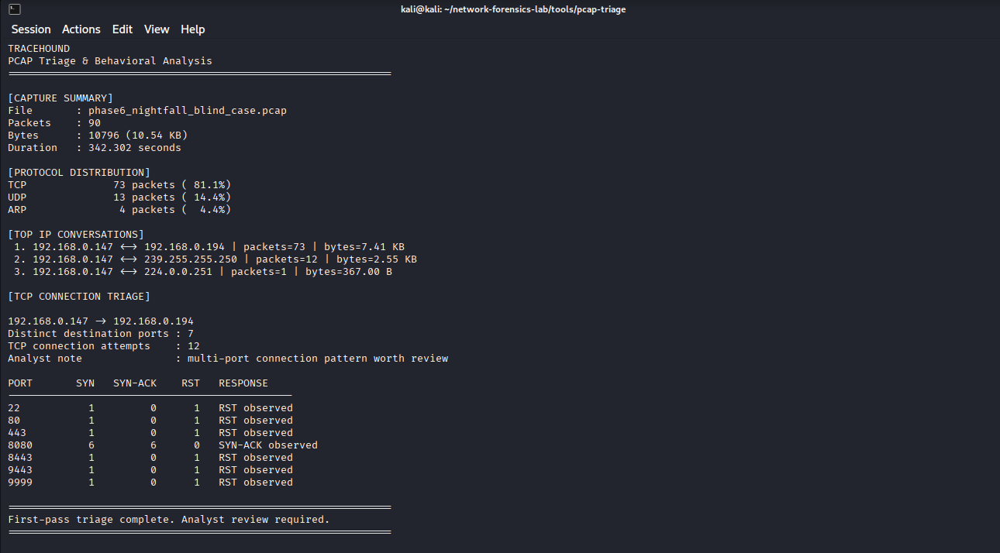
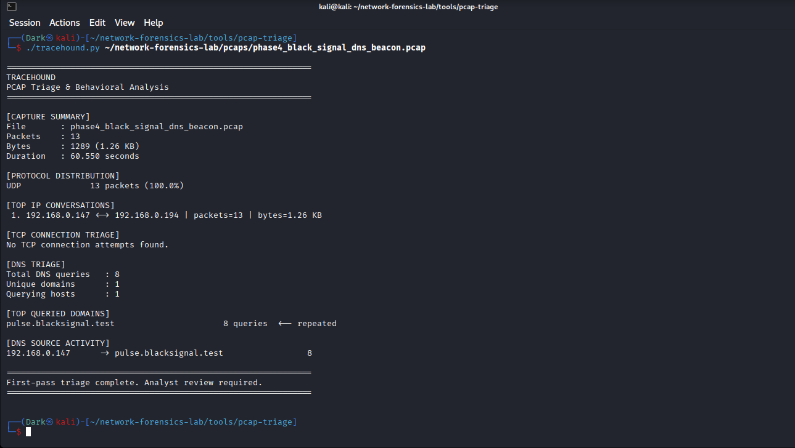
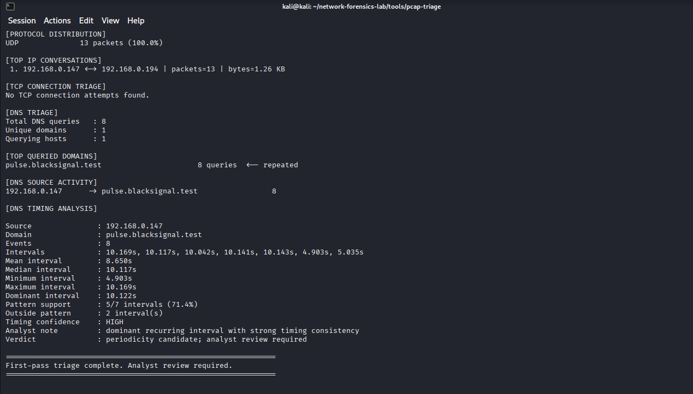
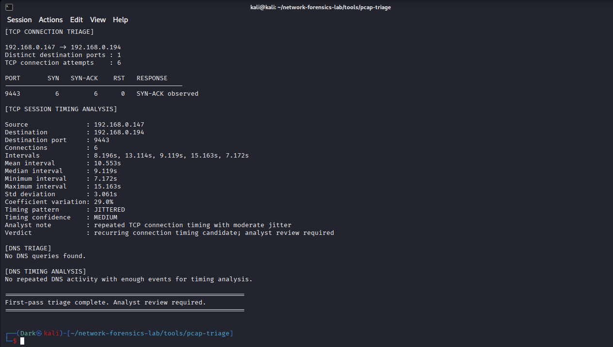
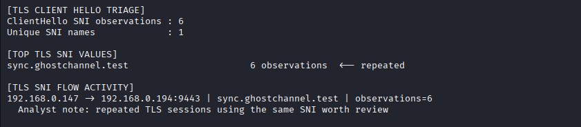
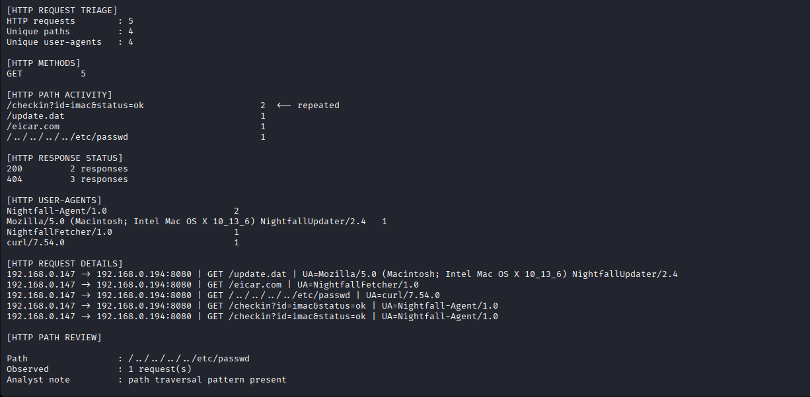

# Phase 07 — TraceHound: PCAP Triage & Behavioral Analysis

> **Manual Analyst Workflow → Python Automation → Timing Heuristics → Multi-PCAP Validation → Analyst Leads**

---

## Phase Overview

The first six phases of this project built the network lab, established baseline traffic, introduced Zeek and Suricata, and completed three progressively harder investigations: **BLACK SIGNAL**, **GHOST CHANNEL**, and **NIGHTFALL**.

By the end of those investigations, the same first-pass analyst tasks were appearing repeatedly:

- establish capture size and duration
- identify dominant protocols and conversations
- count TCP connection attempts and responses
- extract repeated DNS queries
- calculate inter-event timing
- compare repeated TLS sessions
- inspect HTTP paths, User-Agents, and response codes
- decide which observations deserved deeper review

Phase 7 asked a different question:

> **Can the repetitive parts of that workflow be automated without automating the analyst's conclusion?**

The result was **TraceHound**, a Python and Scapy-based PCAP triage utility built specifically from the investigation techniques already used manually in this lab.

TraceHound does not attempt to replace Wireshark, TShark, Zeek, Suricata, or analyst reasoning. Its purpose is to move an analyst from an unfamiliar PCAP to a concise set of evidence-backed leads faster.

---

# Design Principle — Evidence Before Verdict

A central rule from the earlier investigations was preserved throughout development:

```text
Raw evidence
    ↓
Tool observation
    ↓
Analyst inference
```

Those layers must not be collapsed into one another.

For example:

- a repeated DNS cadence can be measured from timestamps
- TraceHound can call that a **periodicity candidate**
- the tool cannot call it command-and-control without additional evidence

Likewise:

- a URI can contain traversal syntax
- TraceHound can surface a **path traversal pattern**
- the tool cannot claim successful file disclosure unless the response proves it

The tool therefore intentionally uses language such as:

```text
worth review
candidate
repeated activity
analyst validation required
```

rather than:

```text
malware detected
C2 confirmed
host compromised
attack successful
```

This was not only a wording choice. It became part of the architecture of the final `Analyst Leads` output.

---

# Development Environment

| Component | Role |
|---|---|
| Kali Linux VM | TraceHound development and PCAP analysis |
| Python 3.13.12 | Runtime |
| Scapy 2.7.x | Packet parsing |
| TShark | Independent field extraction and validation |
| capinfos | Independent capture metadata validation |
| Existing Phase 4–6 PCAPs | Behavioral regression / validation set |

The final script is stored at:

```text
tools/pcap-triage/tracehound.py
```

The development versions were checkpointed locally while the final repository contains only the finished tool.

---

# v0.1 — Capture Summary

The first version intentionally did very little.

Its purpose was to establish a reliable base capable of reading a PCAP sequentially and producing:

- packet count
- total captured bytes
- capture duration
- protocol distribution
- top bidirectional IP conversations

The initial test used:

```text
phase6_nightfall_blind_case.pcap
```

TraceHound reported:

```text
Packets    : 90
Bytes      : 10796
Duration   : 342.302 seconds
TCP        : 73
UDP        : 13
ARP        : 4
```

The dominant conversation was:

```text
192.168.0.147 <-> 192.168.0.194
73 packets
```



## Independent Validation

Before building more features, these values were verified independently.

`capinfos` returned:

```text
Number of packets: 90
Capture duration: 342.301555 seconds
```

TShark independently returned:

```text
TCP: 73
UDP: 13
ARP: 4
```

and its IPv4 conversation statistics confirmed the same three IP conversations and packet counts.

This established a development rule used throughout the phase:

> **TraceHound output would not be trusted simply because TraceHound produced it. Important features had to be independently checked before being accepted.**

---

# v0.2 — TCP Connection Triage

The next feature extracted initial client SYN packets and correlated them with SYN-ACK and reset responses.

For each source/destination/port combination, TraceHound counted:

```text
SYN
SYN-ACK
RST
```

When replayed against NIGHTFALL, the output reconstructed the seven-port pattern:

```text
22
80
443
8080
8443
9443
9999
```

TCP/8080 stood apart from the others:

```text
8080 → 6 SYN, 6 SYN-ACK, 0 RST
```

while the other six ports each produced a reset.



The tool surfaced:

```text
multi-port connection pattern worth review
```

rather than automatically labelling the traffic a port scan.

Independent TShark filters for initial SYN, server SYN-ACK, and server reset packets matched the TraceHound counts exactly.

---

# v0.3 — DNS Triage

The first protocol-specific behavioral parser focused on DNS queries.

TraceHound began recording:

- total DNS queries
- unique domains
- querying hosts
- repeated domain counts
- source-to-domain activity

The BLACK SIGNAL PCAP was used as the first test because its expected behavior had already been investigated manually in Phase 4.

TraceHound independently extracted:

```text
Total DNS queries : 8
Unique domains    : 1
Querying hosts    : 1
```

and identified:

```text
pulse.blacksignal.test
8 queries
```



This was useful, but repetition alone was not the important BLACK SIGNAL behavior.

The next requirement was timing.

---

# v0.4 — DNS Timing & Periodicity

A naive implementation could calculate the mean interval between all repeated events and stop there.

That would have been misleading for BLACK SIGNAL.

The captured query intervals were:

```text
10.169s
10.117s
10.042s
10.141s
10.143s
4.903s
5.035s
```

The two shorter intervals came from the retry-like tail of the capture and pulled the overall mean down to:

```text
8.650s
```

The median remained near the underlying recurring cadence:

```text
10.117s
```

To avoid letting a small number of outliers hide the dominant pattern, TraceHound added interval clustering.

For each candidate interval, the tool builds a tolerance band of:

```text
max(1 second, candidate × 15%)
```

and identifies the largest cluster of similar intervals. When equal-sized clusters exist, the one with lower population standard deviation is preferred.

Against BLACK SIGNAL, TraceHound surfaced:

```text
Dominant interval : 10.122s
Pattern support   : 5/7 intervals (71.4%)
Outside pattern   : 2 intervals
Timing confidence : HIGH
```



The output deliberately retained the two non-clustered intervals rather than hiding them.

The final conclusion was therefore not "beacon detected". It was:

> **A dominant recurring DNS timing pattern exists and deserves analyst review.**

The query timestamps and interval calculations were independently reproduced with TShark and `awk` before this feature was accepted.

---

# v0.5 — Jitter-Aware TCP Session Timing

BLACK SIGNAL contained a relatively stable cadence.

GHOST CHANNEL was designed to be harder because its six encrypted sessions were separated by intentionally variable delays.

The manually established session intervals were approximately:

```text
8.196s
13.114s
9.119s
15.163s
7.172s
```

A strict periodicity detector could fail to recognize this as recurring behavior because the intervals were not tightly clustered.

TraceHound therefore added a second timing method for repeated TCP sessions based on the **coefficient of variation**:

```text
CV = population standard deviation / mean interval
```

For GHOST CHANNEL, the result was:

```text
Connections           : 6
Mean interval         : 10.553s
Standard deviation    : 3.061s
Coefficient variation : 29.0%
Timing pattern        : JITTERED
Timing confidence     : MEDIUM
```



This allowed TraceHound to distinguish between highly regular timing and repeated timing with moderate jitter while still avoiding a maliciousness verdict.

Independent TShark extraction reproduced the six connection starts and interval sequence.

---

# v0.6 — TLS ClientHello SNI Correlation

Timing alone did not identify what the repeated TCP/9443 sessions represented.

The next feature parsed TLS ClientHello records directly from TCP payloads and extracted Server Name Indication values.

The parser was intentionally not limited to TCP/443 because GHOST CHANNEL used:

```text
TCP/9443
```

TraceHound independently found:

```text
ClientHello SNI observations : 6
Unique SNI names             : 1
sync.ghostchannel.test       : 6 observations
```

and correlated them with:

```text
192.168.0.147 -> 192.168.0.194:9443
```



The combination of timing and TLS identity was stronger than either observation alone:

```text
repeated TCP sessions
        +
moderate timing jitter
        +
same TLS SNI
```

But the encrypted payload remained unavailable.

The correct tool-level observation therefore remained:

> **Repeated TLS sessions using the same identity are worth analyst review.**

TShark TLS dissection independently returned the same SNI six times.

---

# v0.7 — HTTP Triage

NIGHTFALL required a different class of evidence.

TraceHound added plaintext HTTP parsing for request metadata and response status lines. The parser extracted:

- request method
- request path
- User-Agent
- source and destination
- destination port
- HTTP response status code

It also added simple path-pattern review for traversal indicators such as:

```text
../
..\\
%2e%2e
%252e%252e
```

Against NIGHTFALL, TraceHound reconstructed all five requests:

```text
/update.dat
/eicar.com
/../../../../etc/passwd
/checkin?id=imac&status=ok
/checkin?id=imac&status=ok
```

The tool independently counted:

```text
HTTP requests      : 5
Unique paths       : 4
Unique User-Agents : 4
200 responses      : 2
404 responses      : 3
```

It also surfaced the repeated check-in URI and flagged:

```text
/../../../../etc/passwd
```

as containing a traversal pattern.



The wording again remained deliberately narrow:

```text
request pattern worth analyst review
```

The tool did not claim successful traversal because the earlier manual investigation had already shown the request received HTTP 404 and no `/etc/passwd` contents were returned.

TShark independently reproduced all five URIs and the `2 × 200` / `3 × 404` response-code split.

---

# v1.0 — Analyst Leads

At this point TraceHound could produce useful sections, but the analyst still had to read the entire output and manually identify the strongest items.

The v1.0 feature therefore consolidated selected observations into:

```text
[ANALYST LEADS]
```

Current lead types are:

```text
MULTI-PORT ACTIVITY
RECURRING TCP TIMING
REPEATED TLS IDENTITY
DNS PERIODICITY
REPEATED HTTP ACTIVITY
HTTP PATH ANOMALY
```

Each lead contains:

```text
Evidence
Context
Assessment
Priority
```

The priority is intentionally `REVIEW` rather than a severity score.

This prevents TraceHound from pretending it can determine business impact or maliciousness from packet structure alone.

---

# Final Multi-PCAP Validation

The finished v1.0 tool was replayed against all three investigation PCAPs with the same generic code and no case-specific indicators hardcoded into the script.

The final result was:

```text
BLACK SIGNAL
  → DNS PERIODICITY

GHOST CHANNEL
  → RECURRING TCP TIMING
  → REPEATED TLS IDENTITY

NIGHTFALL
  → MULTI-PORT ACTIVITY
  → RECURRING TCP TIMING
  → REPEATED HTTP ACTIVITY
  → HTTP PATH ANOMALY
```


This was the most important validation step in Phase 7.

The tool was not taught:

```text
pulse.blacksignal.test
sync.ghostchannel.test
/update.dat
/eicar.com
/checkin?id=imac&status=ok
/../../../../etc/passwd
```

as expected answers.

Those values were extracted from the packet captures at runtime.

The same analysis logic therefore produced different behavioral leads because the underlying evidence was different.

---

# What TraceHound Automates

TraceHound automates repetitive first-pass tasks:

```text
read packet capture
      ↓
summarize protocols and conversations
      ↓
extract TCP / DNS / TLS / HTTP evidence
      ↓
calculate repeated timing behavior
      ↓
surface candidate patterns
      ↓
produce analyst leads
```

It is particularly useful for answering questions such as:

- Which hosts dominate the capture?
- Which destination ports were contacted?
- Which services responded differently?
- Which domains repeat?
- Are repeated events strongly periodic or jittered?
- Do repeated TLS sessions share the same SNI?
- Which HTTP resources repeat?
- Are there obvious path patterns worth reviewing?

---

# What TraceHound Does Not Automate

TraceHound deliberately does **not** answer questions that require contextual judgment, such as:

```text
Is this malware?
Is this command-and-control?
Was this exploitation successful?
Is this user behavior legitimate?
How severe is this activity?
Does this represent compromise?
```

Those decisions require additional evidence.

This distinction became especially important during NIGHTFALL.

The generic TCP timing engine saw six sessions to TCP/8080 and classified their spacing as jittered with medium confidence. Statistically, that was correct. Analytically, however, the six sessions represented several different HTTP actions: artifact retrievals, a traversal attempt, and repeated check-ins.

Therefore:

> **A statistically recurring service pattern is an investigative lead, not proof that every session belongs to one behavioral sequence.**

That limitation is intentionally documented rather than hidden.

---

# Technical Architecture

The final script keeps the implementation understandable enough to defend in an interview rather than hiding behavior behind a large framework.

Major logical areas include:

```text
packet loading / iteration
protocol classification
IP conversation tracking
TCP state triage
TCP session timestamp collection
DNS extraction and timing
TLS ClientHello / SNI parsing
HTTP request / response parsing
behavioral heuristics
analyst lead consolidation
report rendering
```

State is primarily stored using Python `Counter`, `defaultdict`, lists, and sets.

Sets are used where retransmission or duplicate observations could otherwise inflate counts, including TCP session and TLS ClientHello tracking.

---

# Heuristic Design

## Multi-Port Review

TraceHound currently surfaces a multi-port lead when one source/destination pair contains at least four observed destination ports.

This is a review threshold, not a scan signature.

## DNS Periodicity

DNS periodicity requires at least four events and three intervals.

A dominant interval cluster is created using a tolerance of:

```text
max(1.0 second, candidate interval × 15%)
```

Confidence depends on event count, cluster support, and variation inside the dominant cluster.

## TCP Timing

Repeated TCP timing uses coefficient of variation.

The current categories are deliberately simple:

```text
REGULAR
JITTERED
VARIABLE
IRREGULAR
```

They communicate statistical character rather than maliciousness.

## Repeated TLS Identity

The v1.0 Analyst Leads section currently requires at least four observations of the same SNI on the same source/destination/service tuple.

## Repeated HTTP Paths

A path repeated at least twice can be surfaced for review.

## Traversal Review

TraceHound searches the request path for common literal or encoded parent-directory patterns.

This identifies suspicious syntax only. It does not inspect application authorization or prove successful file access.

---

# Validation Philosophy

A major lesson from this phase was that building an analysis tool creates a new risk:

> **The analyst can begin trusting the tool because they wrote it.**

To avoid that, feature development followed a consistent pattern:

```text
build feature
    ↓
run TraceHound
    ↓
state exactly what it claims
    ↓
reproduce the claim with an independent tool
    ↓
accept or fix the implementation
```

Examples included:

- `capinfos` vs TraceHound capture metadata
- TShark vs TraceHound protocol counts
- TShark conversation tables vs TraceHound host summaries
- TShark SYN/SYN-ACK/RST filters vs TCP triage
- TShark DNS timestamps vs periodicity intervals
- TShark TCP SYN timestamps vs jitter analysis
- TShark TLS fields vs SNI extraction
- TShark HTTP fields vs URI and response-code counts

This made tool validation part of the investigation rather than an afterthought.

---

# Limitations

The final v1.0 tool has intentional boundaries.

### No Full TCP Reassembly

TraceHound reads packet payloads directly. HTTP or TLS metadata fragmented across multiple packets may therefore be missed.

### Metadata Is Not Payload Meaning

TLS SNI can be extracted before encryption, but encrypted application data cannot be interpreted without decryption material.

### Timing Can Produce False Leads

Backups, monitoring agents, software updates, health checks, and legitimate polling can all generate regular or jittered recurring traffic.

### Grouping Is Simplified

Repeated TCP timing is grouped by source IP, destination IP, and destination port. Multiple application actions against one service can therefore be grouped into one statistical timing series.

### Incomplete Captures Change Conclusions

Packet loss, capture filters, or starting a capture mid-session can change counts, intervals, and response correlation.

### Pattern Recognition Is Not Exploit Validation

A suspicious path, repeated domain, or multi-port sequence describes the network evidence. It does not establish intent, compromise, or impact on its own.

These limitations are why every final report ends with:

```text
First-pass triage complete. Analyst review required.
```

---

# Skills Demonstrated

Phase 7 combined network forensics with software development and validation.

The work demonstrated:

- Python scripting for security analysis
- Scapy packet parsing
- PCAP iteration and metadata extraction
- protocol-aware parsing
- TCP flag analysis
- conversation aggregation
- statistical timing analysis
- coefficient-of-variation reasoning
- tolerance-based interval clustering
- DNS behavior analysis
- TLS ClientHello / SNI extraction
- plaintext HTTP parsing
- defensive pattern heuristics
- false-positive-aware analyst language
- independent tool validation
- regression testing across multiple investigation datasets
- translating manual analyst workflows into repeatable automation

---

# Interview Talking Point

A concise explanation of the phase is:

> **After manually completing three network investigations, I built TraceHound to automate the repetitive first-pass triage I kept performing by hand. It parses PCAPs with Scapy, summarizes conversations, evaluates TCP connection behavior, measures DNS and TCP timing, extracts TLS SNI and plaintext HTTP metadata, and then surfaces evidence-backed analyst leads. I validated each major feature independently with TShark or capinfos and replayed the final generic tool against all three previous cases. The important design choice was that it never claims C2 or compromise from heuristics alone — it automates evidence collection while leaving the final interpretation to the analyst.**

---

# Final Result

Phase 7 changed the project from a collection of manual network investigations into something more reusable.

The progression across the project became:

```text
Capture traffic
      ↓
Understand normal behavior
      ↓
Investigate suspicious behavior manually
      ↓
Correlate with Zeek and Suricata
      ↓
Identify and close a detection gap
      ↓
Automate repetitive triage with TraceHound
```

TraceHound successfully surfaced the defining behaviors of BLACK SIGNAL, GHOST CHANNEL, and NIGHTFALL using the same generic analysis code.

The strongest lesson from the phase remained consistent with the rest of the project:

> **Automation is most useful when it makes evidence easier to find without pretending to replace the analyst who must interpret it.**
